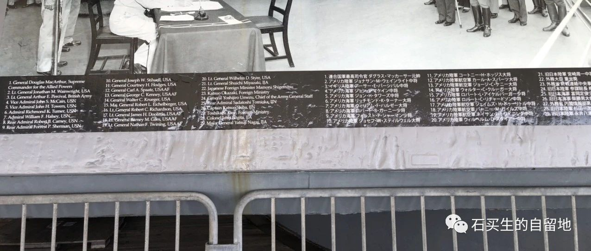
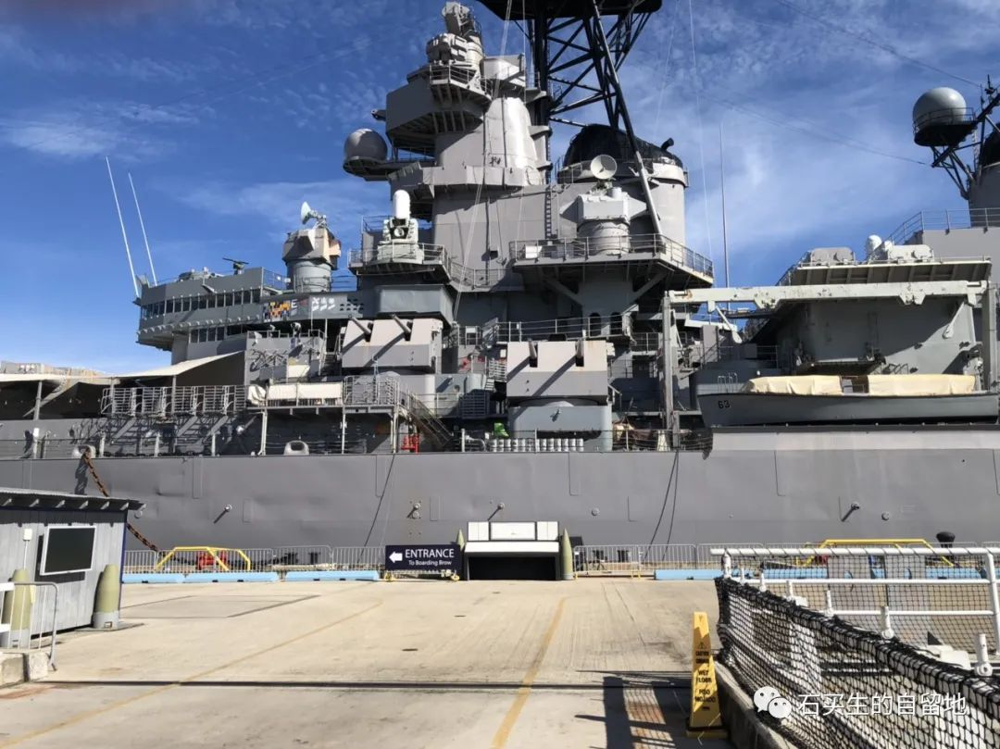
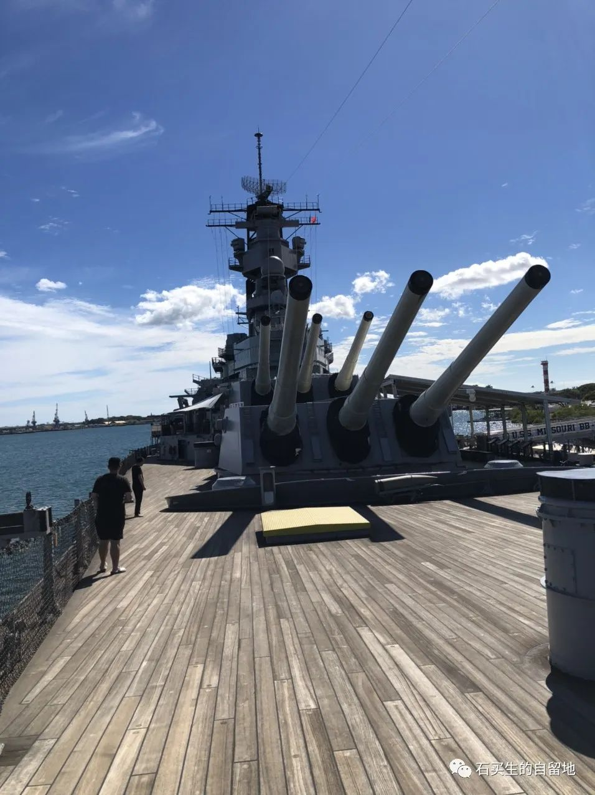
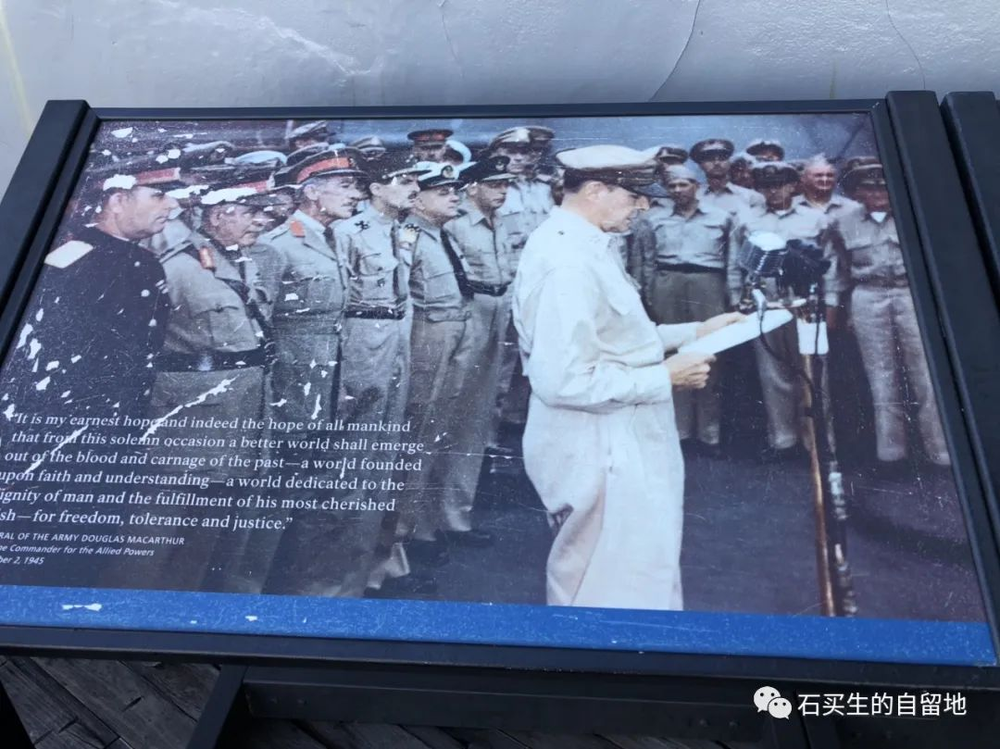
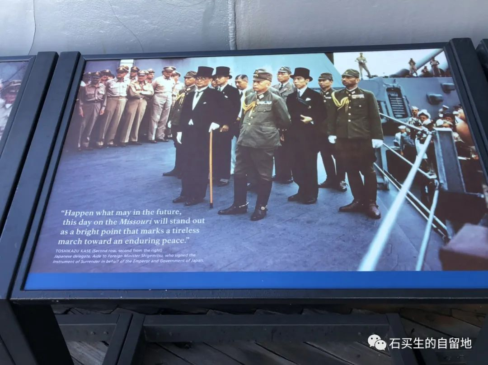
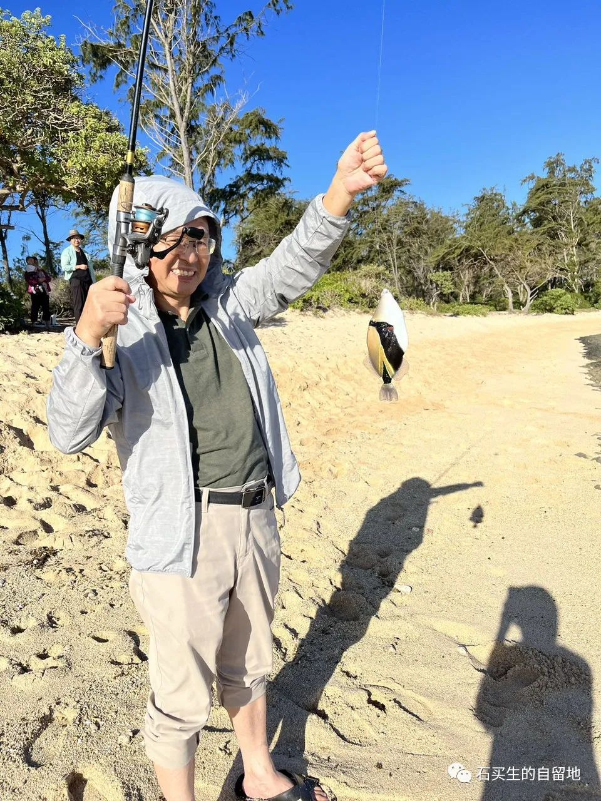

#  密苏里战列舰

原创  石买生  [ 石买生的自留地 ](javascript:void\(0\);)

__ _ _ _ _

​

密苏里号战列舰

  

珍珠港海水乌泱一片

密苏里战舰在午后阳光下出奇地安详

我和几个游人在甲板上徜徉

九门大炮分列船头船尾直指蓝天

它们的喑哑和冰冷也令人战栗

我们在船舱里穿梭

观察室、锅炉房、就寝间回环曲折让人头昏目眩

餐厅宽敞整洁，面包模型、餐具一应俱全

休息室衣帽间一点也不慵懒

一副国际象棋棋盘支起

无半点宁静之感似乎随时硝烟四起振聋发聩

从船头到船尾你看到岁月不断翻转紧张激烈刺激简直没有休止符

最令人瞩目的是甲板上再现的当年签字受降仪式

我看见了发黄的纸页上

几个熟悉的汉字：重光葵  梅津美治郎  徐永昌

照片上麦克阿瑟将军表情凝重几个日本军官脸的一点也不羞愧

好像战争输的很不情愿

偷袭珍珠港似乎成了大日本的无上荣光

密苏里号战列舰正前方约  100  米

一艘战列舰没入水中只剩下旗杆在海面飘扬猎猎作响

那是当年被日本海军击沉的亚利桑那号战列舰

那飘扬的旗帜告诉我们

战争是暂时的只有和平代表永恒

​

  

  

​

​

  

  

海钓

  

第一次海钓

纯粹是过过手瘾

除了一条漂亮的海鱼

就是海浪跟脚丫丫

不断的亲吻

  

​

  

预览时标签不可点

微信扫一扫  
关注该公众号

****

****

×  分析

__

微信扫一扫可打开此内容，  
使用完整服务

：  ，  ，  ，  ，  ，  ，  ，  ，  ，  ，  ，  ，  。  视频  小程序  赞  ，轻点两下取消赞  在看  ，轻点两下取消在看
分享  留言  收藏  听过

精选留言

