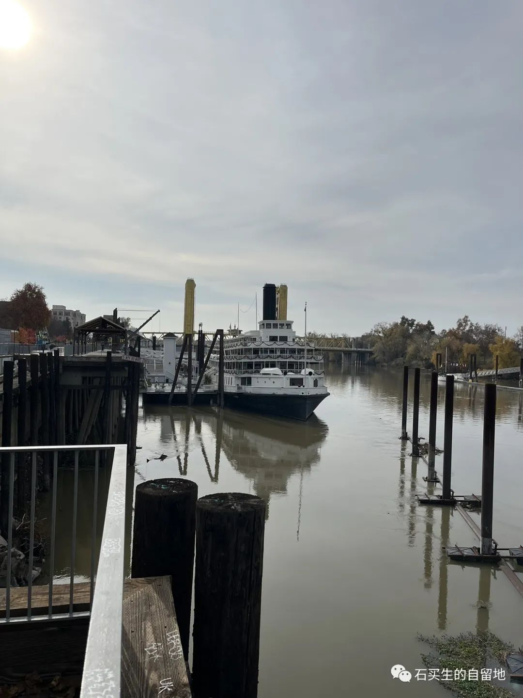
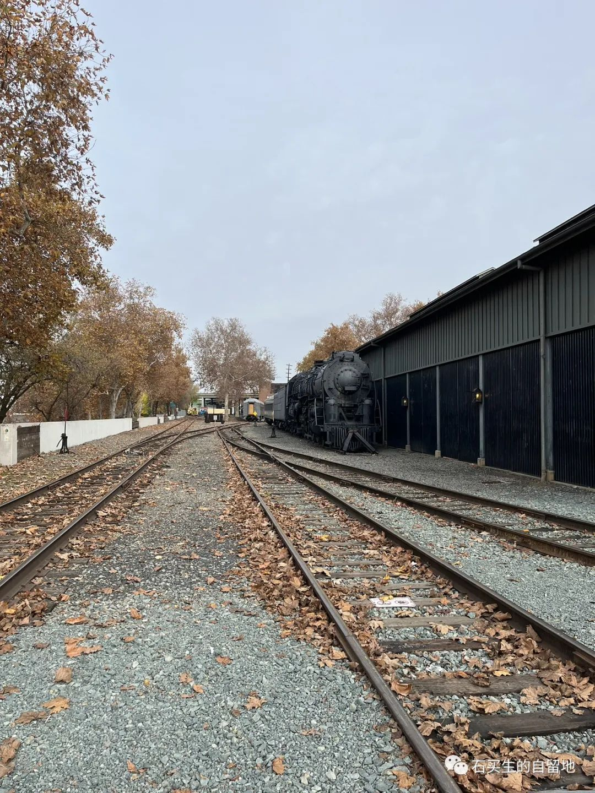
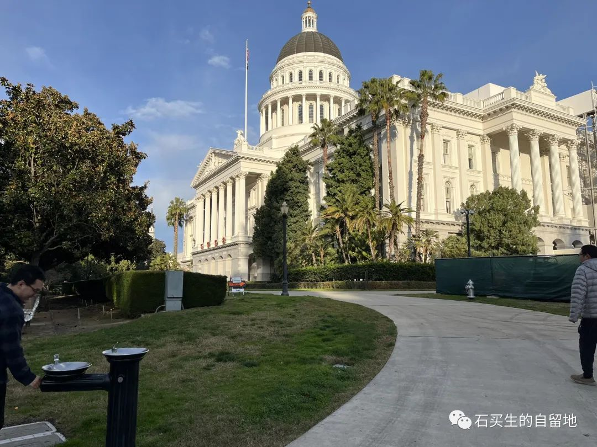

#  淘金城影像记

原创  石买生  [ 石买生的自留地 ](javascript:void\(0\);)

__ _ _ _ _

  

  

​

萨克拉门托河

  

  

萨克拉门托河

  

奶白色河水有点浑浊

海狮在漩涡里翻滚

枯草和木屑

顺流而下

一艘旧邮轮毗邻河边的木桩

和一些古老的建筑

在正午的阳光下一一定格

西部牛仔哪里去了

当年的淘金者

他们的残梦穿越两百年

让一座小城

慵懒而颓废

在冬日

散发潮湿发霉的气息

  

​

街头笛子演奏家

  

街头艺术家

  

一个中年男子鼓起腮帮

竖的吹起了笛子

是苏格兰风笛

还是东方竹笛

音调悠扬婉转情深

演奏者在演绎一个时代故事

在重温一个旧梦

纯粹而投入

天空中的飞鸟声

游客的脚步声

城里的市声

都变成他笛声里的音符

浪漫而温馨

唯美而撩人

  

​

废弃的火车

  

  

废弃的火车

  

黑色的火车

暗黄色的火车

在废弃的铁轨上静卧着

一卧就是百年？

列车当年呼啸的英姿

在美利坚西部

怎样绚烂如舞动的彩虹

怎样书写一段一段淘金的历史

停歇和废弃

不是宿命

是在缅怀历史深处的跫音

和风情

  

​

市政大楼

  

市政大楼掠影

  

历史公园里的香樟

树干高大直耸云天

树叶翠绿闪亮

这些来自日本中国的珍贵树种

和毗邻的来自英国的红杉

让公园更加安静肃穆

草也在沉思

鸟在呢喃

夕阳抹在市政大楼白色尖顶上

你恍然悠然

仿佛来到白宫

来到假的美利坚

奇怪呀

你仍然心满意足

你知道这不是朝圣

这是圣诞一次小小的心愿

  

  

注：照片系自拍

预览时标签不可点

个人观点，仅供参考

微信扫一扫  
关注该公众号

****

****

×  分析

__

微信扫一扫可打开此内容，  
使用完整服务

：  ，  ，  ，  ，  ，  ，  ，  ，  ，  ，  ，  ，  。  视频  小程序  赞  ，轻点两下取消赞  在看  ，轻点两下取消在看
分享  留言  收藏  听过

精选留言

谈华楼来自江西

普通的场景在老石的眼里就成了诗[玫瑰]

石买生的自留地来自

谢谢谭兄鼓励！[咖啡][握手]

吴丰强来自广东

和老石神游美国过去和现在[玫瑰][玫瑰]

石买生的自留地来自

[咖啡][握手]

