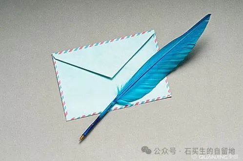

#  与弟子书

原创  石买生  [ 石买生的自留地 ](javascript:void\(0\);)

__ _ _ _ _

​

图片来自网络

  

与弟子书

  

癸卯年农历六月，我退休时，我的  88
位关门弟子，或修书与我，或馈赠什物，此份情谊和缘分，弥足珍贵。此时，身处异国，我亦修书几封，以斑窥豹，遥祝所有弟子学业有成，各自安好！

——  题记

  

给  L

  

你让

那么多蓝色的星星

一颗一颗

簇拥在一个透明的宇宙里

不停地闪烁

在日里夜里

  

我在加州眺望故国

没有看见春花

只看见秋月

和冬日草尖上的露珠

那颗会穿越的古典的心啊

晶莹剔透

  

一颤

一闭眼

便拥有灿灿星空

缈缈银河

  

我喜欢

你爱落日的姿态

你把长安

叫帝国的都城

这不是颓废

这是稀缺的忠诚

  

你如果说

有些美

能分成两瓣梅花

我想说

好的

​

图片来自网络

  

给  O

  

你因为爱羊

便拥有了草原

与无垠

因为爱鸥鸟

你便拥有了天空

与广阔

  

还有大海在召唤

潮水奔腾不息

  

轻言与软语

总在诉说浪漫

与衷情

  

我曾见一颗豌豆大的心

满世界漫游

许多年过去了

几乎同样的一颗心

又回来了

  

上帝

爱投骰子

却不告诉你为什么

​

图片来自网络

  

给  N

  

你的火热和赤诚

是正在猎猎作响的青春之旗

  

谢谢你

走近我的心灵

比夕阳还早一点

  

你爱我的自然和随意

我喜你的张扬和有趣

  

你我想拥抱的

都是世上最美好的

  

你不断想把自己抛出去

我不断想把自己收回来

  

在一个不确定的时代

我们都在试图找回自己

  

缘聚缘散

我们在两个纬度

遥遥相对

​

图片来自网络

  

给  F

  

冬日

圣克拉拉的黄玫瑰

在路边一户门前的花盆里

闲散开着

自在又随意

清香四溢

  

它的清丽

比不上你的圣洁

你的黄玫瑰啊

让毕达哥拉斯为难

大于零

小于三

  

博尔赫斯

梦中看见一个手捧玫瑰的人

醒来后不认得自己

我也不知道

发黄的信笺上粘贴的

是永恒

还是唯一

​

图片来自网络

  

给  H

  

“老师，记得分享你的日常。”

我记得你的祈愿

把每一天当作最后一天

爱自己陪伴亲人

尽量把所有人看作初民

接纳自己和外人的平凡

善待万物摒弃仇恨

平静度过每一天

不留下亏欠

我的日常

如果不如你所想所艳羡

只留下单调枯燥重复

只剩下一地鸡毛

你也不要失望

生活的本质就是这样子的

不可能总是多姿多彩

黯淡无光

也许是活着的常态

  

  

注：图片来自网络

预览时标签不可点

微信扫一扫  
关注该公众号

****

****

×  分析

__

微信扫一扫可打开此内容，  
使用完整服务

：  ，  ，  ，  ，  ，  ，  ，  ，  ，  ，  ，  ，  。  视频  小程序  赞  ，轻点两下取消赞  在看  ，轻点两下取消在看
分享  留言  收藏  听过

精选留言

