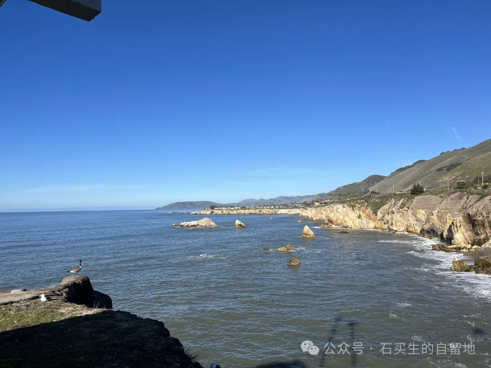
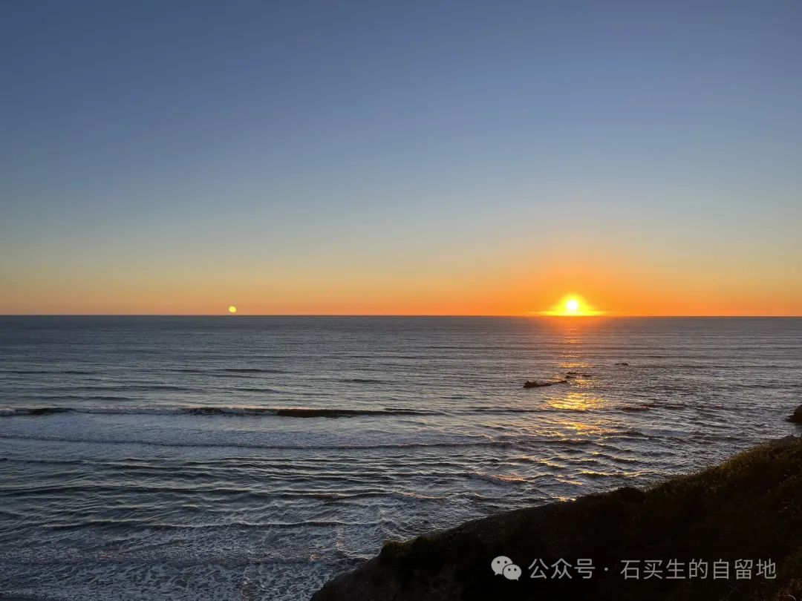
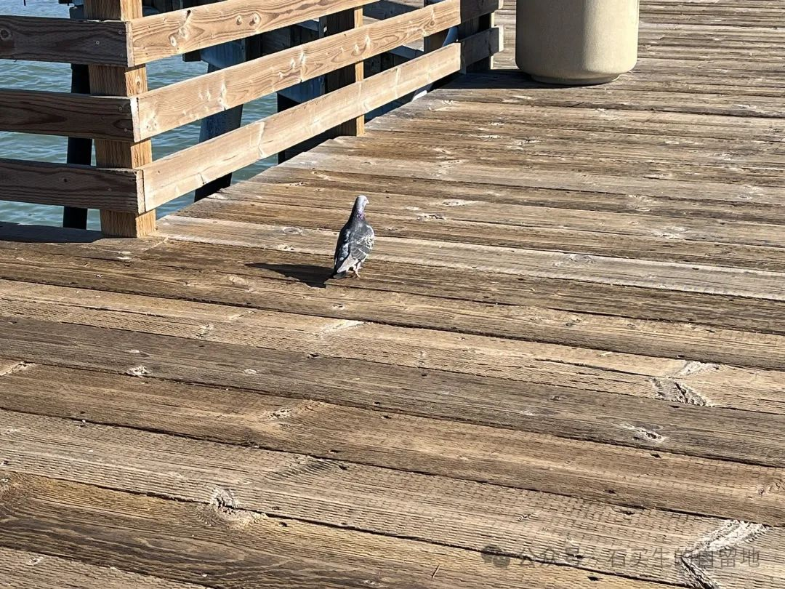
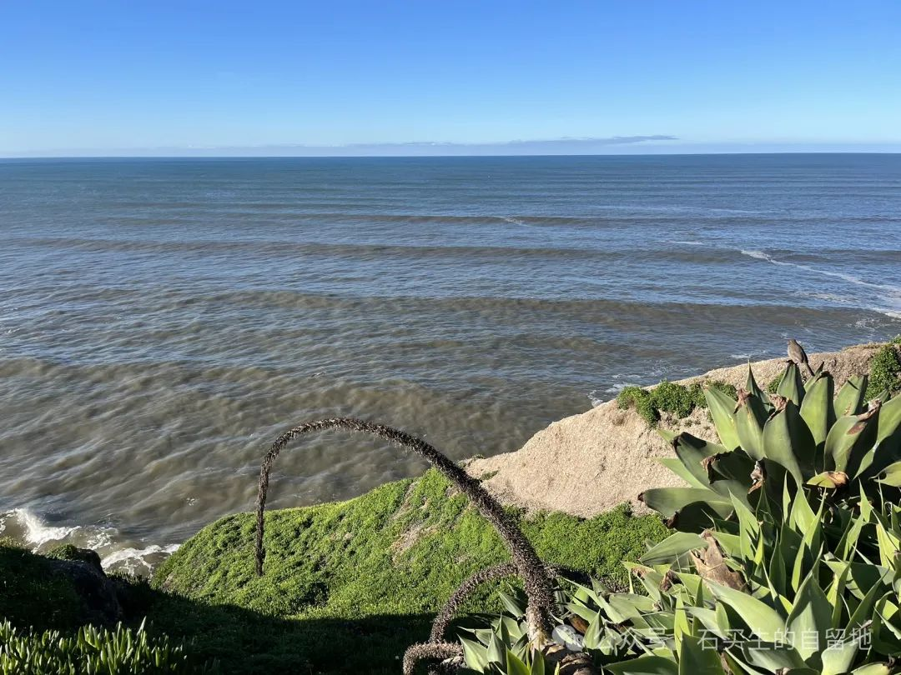

#  湾区日志

原创  石买生  [ 石买生的自留地 ](javascript:void\(0\);)

__ _ _ _ _

​

自拍照片

  

湾区日志

  

  

纪念

  

一个六十岁的老人和他的夫人

来海边度假

重温十年前蓝色的海浪微凉的海风

看金色的夕阳和白云自在地慵懒

感受白色鸥鸟在海面自由飞翔

他用低语抚摸岁月

她用倾听颔首示意

彼此微笑既是一辈子倾心相许

连沉默也是恰如其好的停顿

尽管他看上去年轻而她有点衰老

但宁静和谐温馨

使他们拥有了生命的黄金

我与他们言语不通但年龄相仿

我羡慕他们

活成了自己喜欢的模样

与爱人携手同岁月言欢冬天面前一族炉火

这不是上帝的恩赐

这是自己献给自己最美好的祝福

​

自拍照片

  

  

垂钓者

  

码头上游人不如织

一个男子抱着几岁的儿子在垂钓

鱼钩没有鱼饵在水面摇摆

鱼线在风中摇曳

父亲和儿子一脸闲适淡然

自得其乐

这样儿

不用说东篱采菊的陶潜看痴

海里的隐约可见的鱼儿也无可奈何

​

自拍照片

  

  

连心锁

  

旧金山金门大桥雄伟壮观

在天底下特别巍峨

在桥头一面网状围栏上

缀有数不清的连心锁

我四岁外孙  Q Q  看着一把把锃亮的锁

不停地用手抚摸

动作温柔表情充满羡慕

他摸摸这把捏捏那把爱意洋溢

当他握住一把漂亮的银色锁想取下它时

我说宝贝这些锁都是好些哥哥姐姐留在这儿的你取不下来

等你长大了你也带你女朋友买把锁锁在这儿那多美呀

Q Q  一听仰起脸一脸懵逼

  

  

疑问

  

在美国生活大半年了

我发现美国佬

特别爱孩子和狗

看见孩子都热情招呼嗨脸上露出慈爱的笑

遛狗既准时又特别用心连步律也一致

胡适说爱孩子是文明的标志

那爱狗又是么子原因呢

​

自拍照片

  

预览时标签不可点

个人观点，仅供参考

微信扫一扫  
关注该公众号

****

****

×  分析

__

微信扫一扫可打开此内容，  
使用完整服务

：  ，  ，  ，  ，  ，  ，  ，  ，  ，  ，  ，  ，  。  视频  小程序  赞  ，轻点两下取消赞  在看  ，轻点两下取消在看
分享  留言  收藏  听过

精选留言

吴丰强来自广东

老石，钓鱼竿带去美国了吗？[愉快]

石买生的自留地来自

老吴过年好！没带鱼竿，石行在这买了呢[呲牙][握手]

秀波来自

缝缝补补之岁月之网🕸️[胜利]

石买生的自留地来自

[咖啡][握手]

