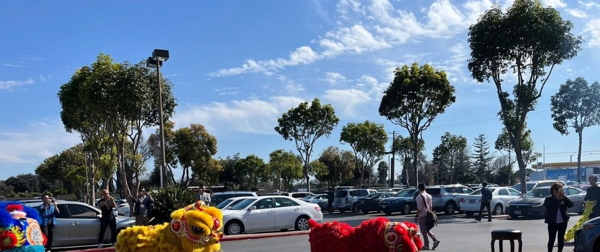
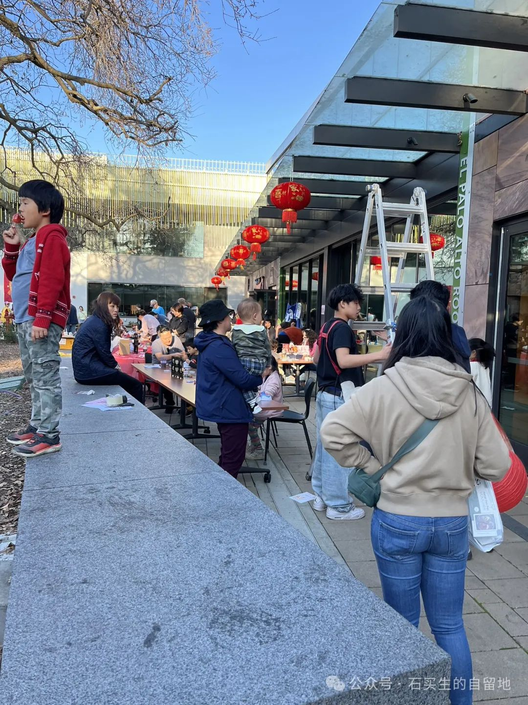
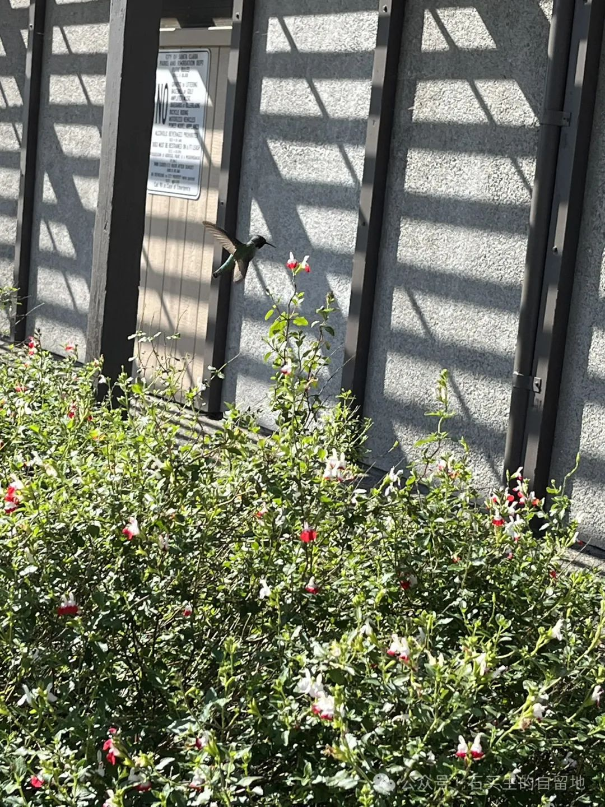
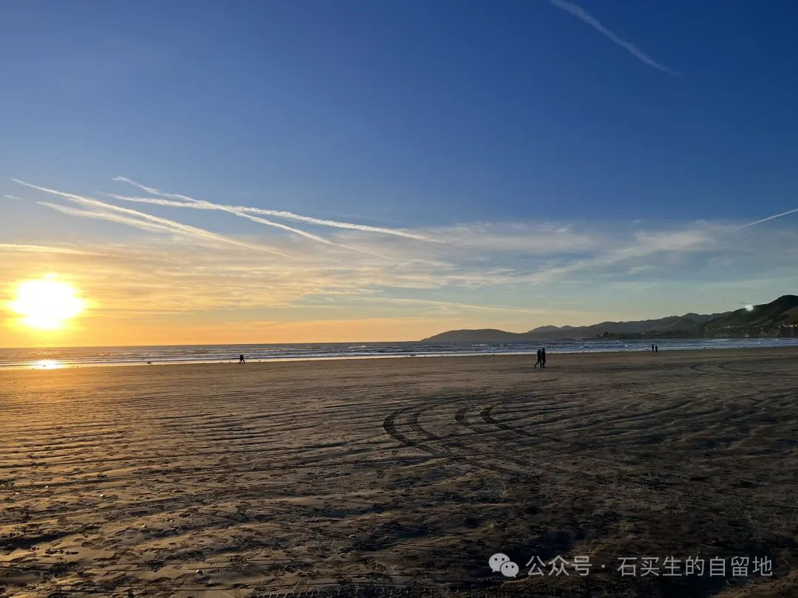

#  在硅谷过年

原创  石买生  [ 石买生的自留地 ](javascript:void\(0\);)

__ _ _ _ _

​

照片系自拍

  

代沟

  

因为身份认同

在车上

我和女儿产生了激烈争执

  

我喜欢黑脸

不惜声嘶力竭

女儿喜欢红脸

竟然歇斯底里

  

最终

谁也没有说服谁

  

其实我们心中的爱与恨

都有点变味儿

  

更荒谬的是

我们争执的内容与时代竟如此合拍

最真实的想法

总是表达不出来

  

​

照片系自拍

  

在硅谷过年

  

相传过年的习俗

最初就出于恐惧与虚妄

人们用红纸春联和红色鞭炮

驱赶怪兽

  

我的一位乡亲对过年总结

最为精辟

说什么新年旧岁

分明是昨日今朝

  

其实哪里过年都一样

图吉祥

瞎折腾

起因是年年不能自已

导致不断重复一生

  

在硅谷过年更加寡淡

看过舞龙舞狮表演

游过元宵灯会

同胞的脸陌生又游弋

  

我更喜欢

樱花开得绚烂

天空安静的蓝

  

它们不强迫我脸上

硬挤出一点喜庆的气氛

​

照片系自拍

  

密码

  

我的小外孙旺仔快一岁半了

他的小手总喜欢

触碰玩具的小开关

小车上捏捏

语音书上按按

飞机模型上点点

从不疲倦总是兴趣盎然

他的每次欢颜

都是上帝赐给人世的祝福和奖赏

那无数个小点点啊

是他懵懂生命的小小密码

他正在寻找

开启未来世界的神秘之门

​

照片系自拍

  

神明

  

我们一家

在退潮的海滩上挖掘寻找牡蛎

我们挖出了很多牡蛎

又用沙子把它们掩埋了

  

我们要找的

是不小于45公分的大牡蛎

听说肉质鲜嫩肥美

  

夕阳西下时

我们终于找到一只大牡蛎

大海听见我们的欢呼

  

几天后被遗忘的牡蛎

在车后备箱里发臭了

它的游魂又回到大海

  

庄子说

无用即有用

他喜欢听自然的箫声

  

庄子和牡蛎

一个在风中逍遥

一只魂归大海

两者都成了我心中的神明

​

照片系自拍

  

预览时标签不可点

微信扫一扫  
关注该公众号

****

****

×  分析

__

微信扫一扫可打开此内容，  
使用完整服务

：  ，  ，  ，  ，  ，  ，  ，  ，  ，  ，  ，  ，  。  视频  小程序  赞  ，轻点两下取消赞  在看  ，轻点两下取消在看
分享  留言  收藏  听过

精选留言

A敏来自广东

校园里看不到石老师了！祝愿您和家人在那里幸福快乐！

石买生的自留地来自

谢谢小王记挂，也祝你阖家安好！你两个宝贝越来越可爱啊，真正的天使[玫瑰][咖啡]

秀波来自

又是二月的月末了！您在彼岸含饴弄孙 也念着故乡和远方，心情跃然纸上呢！

石买生的自留地来自

拳拳之心，时常有之，谢谢鼓励！[咖啡][握手][玫瑰]

吴丰强来自广东

      更荒谬的是我们争执的内容与时代竟如此合拍       最真实的想法总是表达不出来     这一点我总是觉得无法表达，老石你表达出来了。[玫瑰][玫瑰][玫瑰]

石买生的自留地来自

谢老吴谬赞！[咖啡][握手]

斯冰来自江西

用说话的方式写诗，用最简陋的瓶子装很醇的酒，这是我喜欢石老师的诗的主要原因

石买生的自留地来自

谢谢冰兄鼓励！[咖啡][握手]

谈华楼来自江西

洞察人性，透视人生[强][强][强]

石买生的自留地来自

谈兄好，久违了，谢谢鼓励！[咖啡][握手][玫瑰]

