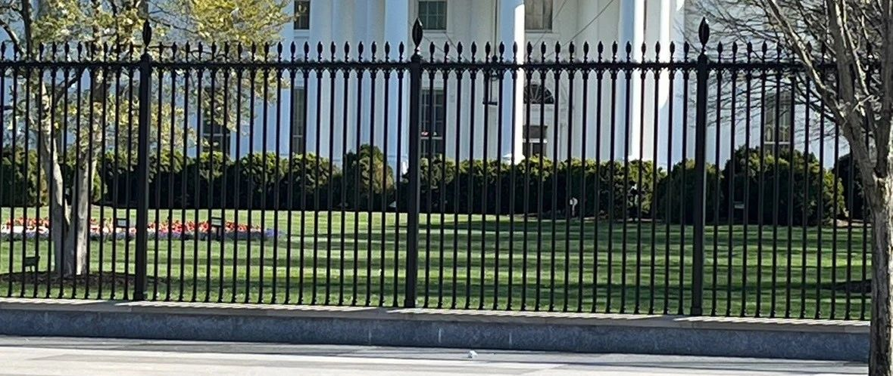
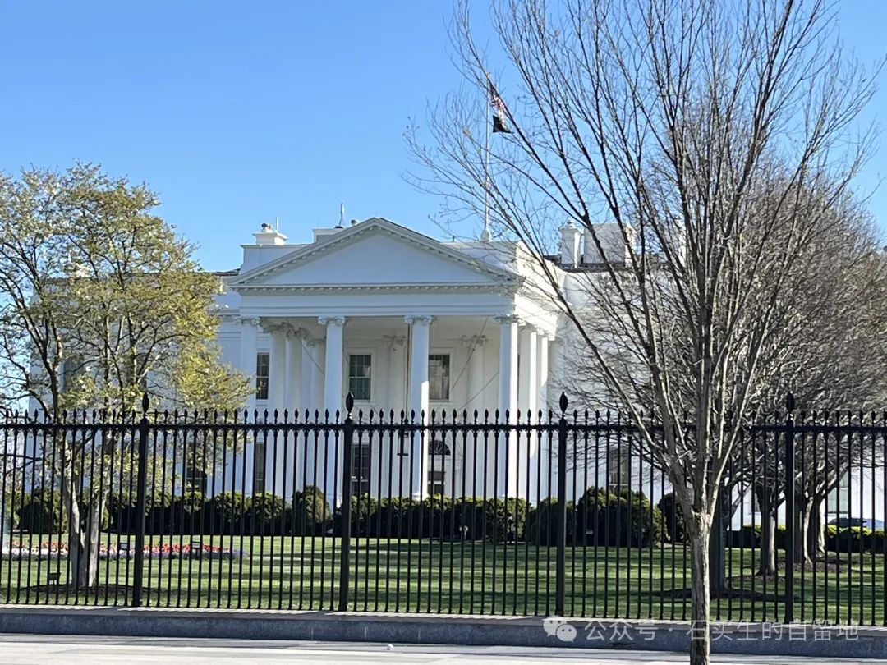
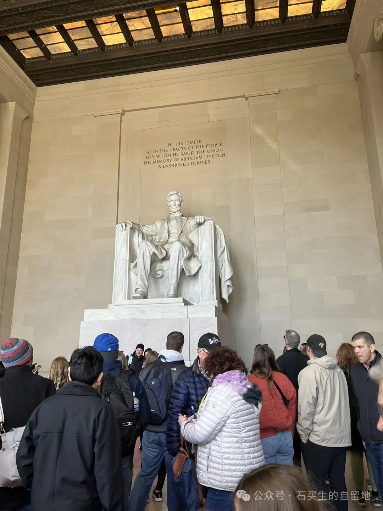
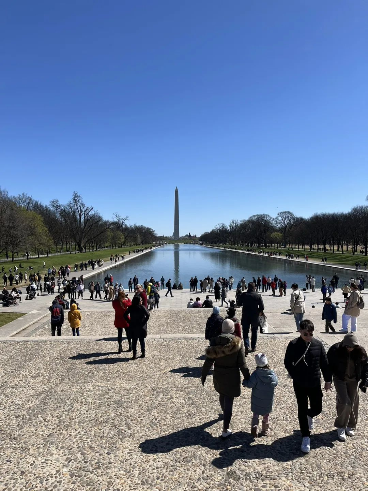
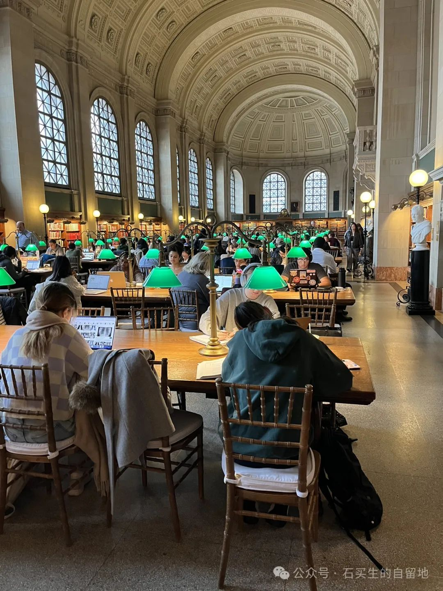

#  白宫门前的树

原创  石买生  [ 石买生的自留地 ](javascript:void\(0\);)

__ _ _ _ _

​

自拍照片  
  

白宫门前的树

  

白宫是一栋两层白色建筑

正门四根立柱

屋顶一面美国国旗在飘扬

怎么看啊这都不过一栋普通别墅

作为建筑

定位世界并不显眼

  

门前有草坪、喷泉、铁围栏

过一条马路

是一个大型自由广场绿草如茵

这里才是世界的中心

你能感受到许多脉搏在跳动

许多树成了白宫的守护神

  

榉树、早柳、榆树、扁桃、悬铃木、银杏

静静守着云翳和天光

阳光下人头攒动树叶随风翻卷

有花在零星开着

黑人在舞蹈，白人在站立

黄皮肤的人在拍照对白宫充满好奇

  

树们一片静穆在安详中期待什么

世界每一个角落只要风吹草动

这里的树都能察觉它们是风中的雷达能准时预测

这不警察出动了

白宫门前有人挥舞三角旗请愿

他喊口号时被警卫驱赶到马路另一边

  

树们扬起高高的臂膀仿佛在对着被驱赶的人高喊

加油

这声音让被压抑的人备受鼓舞和激励

这是自由之声能及时让拜登听见

也曾清洗过特朗普和奥巴马的耳朵

它像贝多芬的音乐一样激越

  

自由广场设有一长溜石板国际象棋棋盘

每一张棋盘前空空如也

棋手缺席黑白世界一片冷落

偶尔一片树叶飘落到棋盘上

它似乎在提醒白宫

黑白世界从不闲着每时每刻都在激烈厮杀

  

​

照片自拍

  

谒林肯纪念堂

  

第一次这么近看这个中年男人

看他清瘦的脸

坚毅的眼神

感觉他胸膛里为普罗大众砰砰跳的心

我老泪纵横

​

照片系自拍

  

反思池

  

在林肯纪念堂和方尖塔之间

是一条长长的方形池水

蓝天映在里面

两边樱花绚烂

清澈的水面有几只鸭子在嬉戏

游人在赏光流连

平静和安宁

也许是一切时代永恒的主题

​

照片系自拍

  

波士顿图书馆一瞥

  

这么多草绿色的台灯下

不是一条条书虫在蠕动

是嘴唇寻找亲吻

是肉体寻找灵魂

是跨越时空的探寻

凡间日益模糊

天堂模样渐显

  

  

注：照片系自拍

  

  

  

  

  

  

  

预览时标签不可点

个人观点，仅供参考

微信扫一扫  
关注该公众号

****

****

×  分析

__

微信扫一扫可打开此内容，  
使用完整服务

：  ，  ，  ，  ，  ，  ，  ，  ，  ，  ，  ，  ，  。  视频  小程序  赞  ，轻点两下取消赞  在看  ，轻点两下取消在看
分享  留言  收藏  听过

精选留言

MAGA_ForrestGump来自广东

有幸在此发表演讲[强][强][强]

石买生的自留地来自

[强][玫瑰]

MAGA_ForrestGump来自广东

[玫瑰]

炒粉别放豆芽来自广东

老师，小米造车会超过特斯拉吗

石买生的自留地来自

个人认为不太可能。时间短，技术也不会领先吧[呲牙]

Joe Biden来自四川

I believe Lincoln was a racist from the beginning to the end[玫瑰][玫瑰]

石买生的自留地来自

[呲牙]

Stephen周9527来自广东

不愧是世界灯塔，伟大！

石买生的自留地来自

[咖啡][握手]

