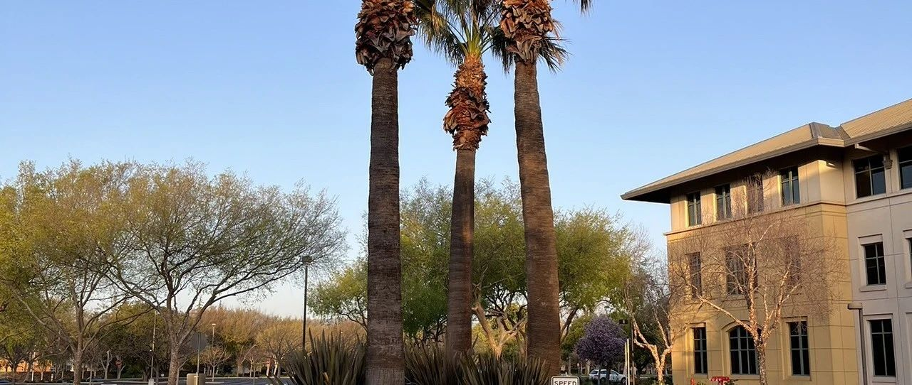
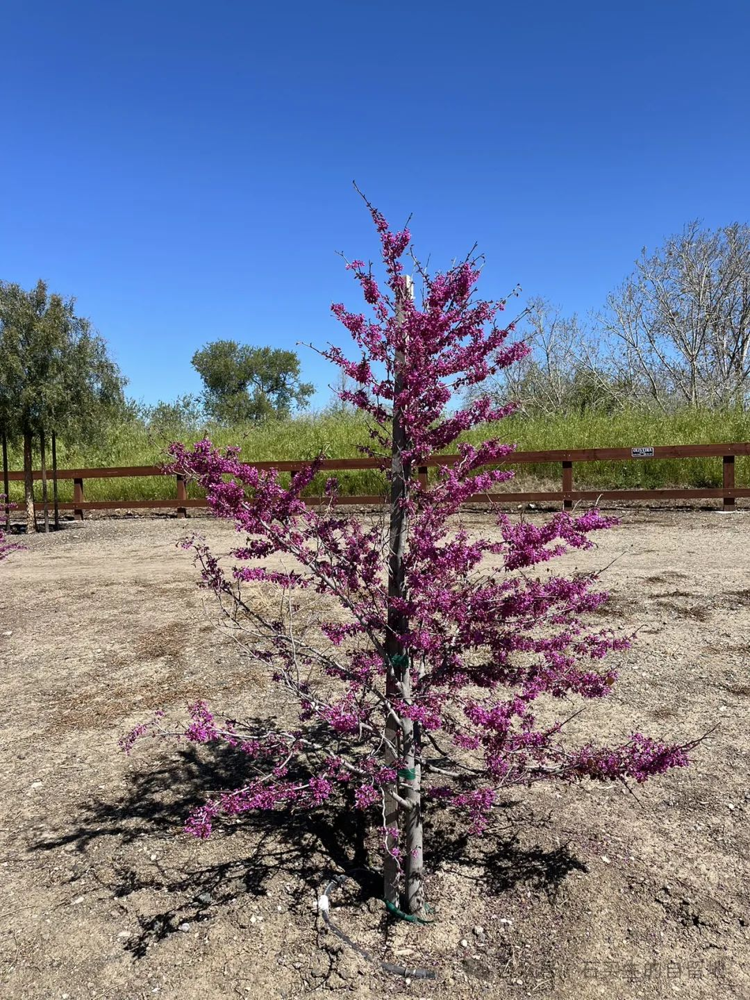
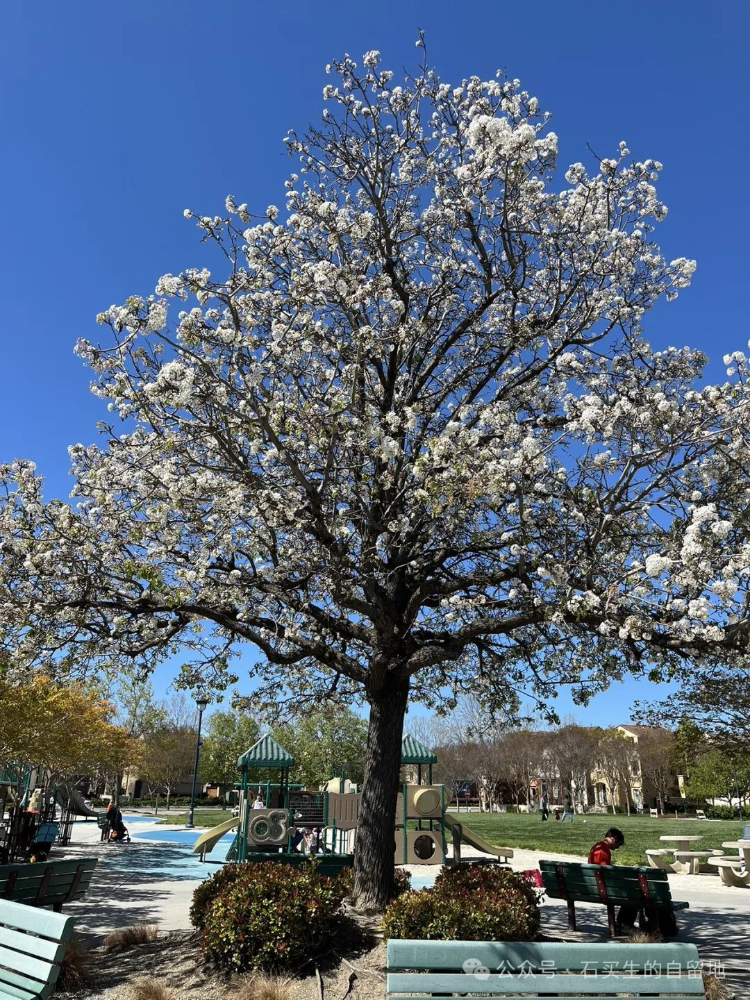
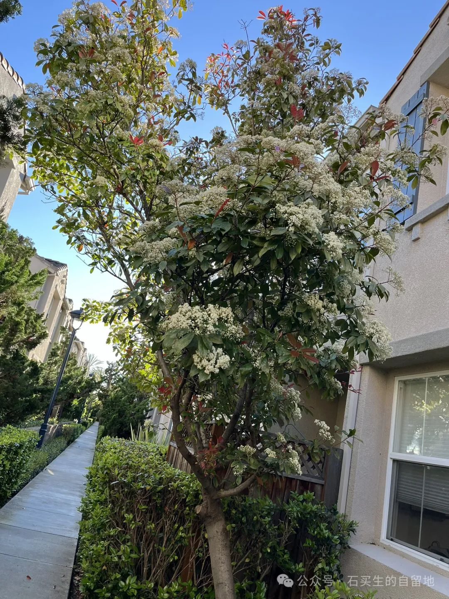
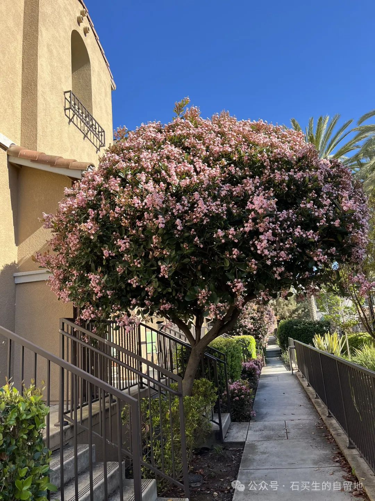
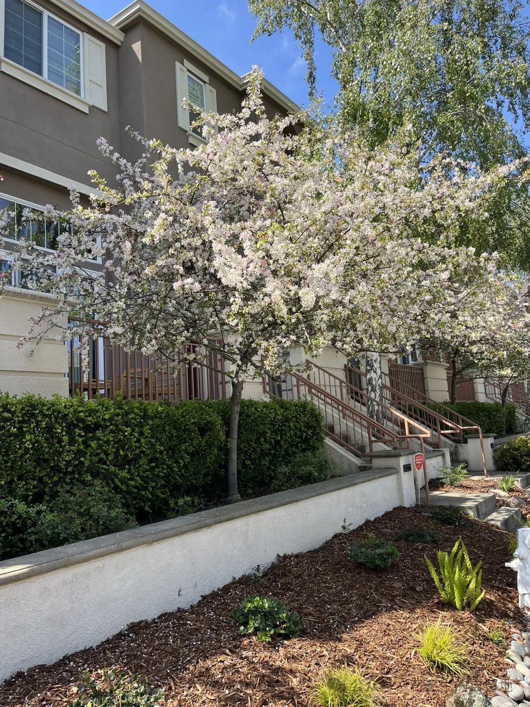
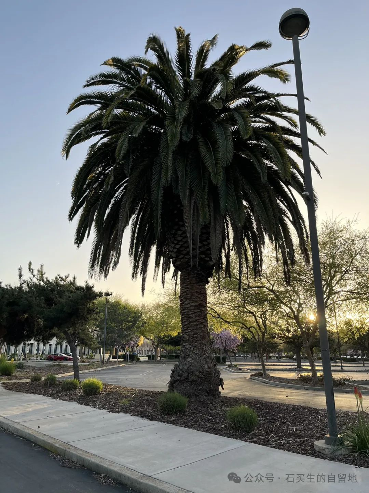
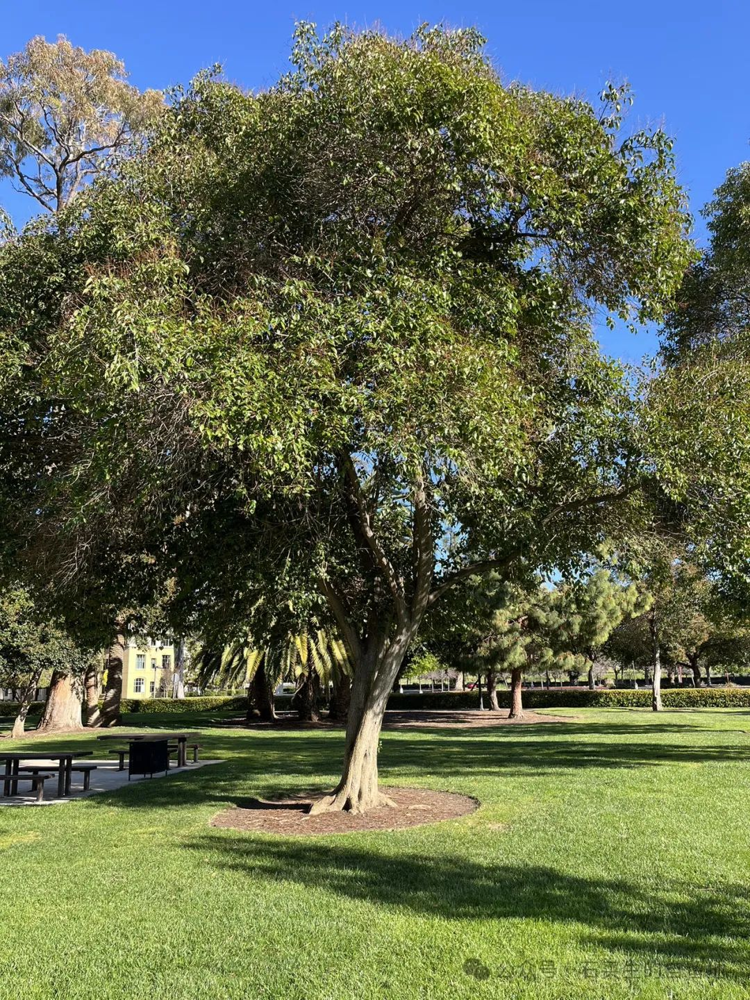

#  圣何塞花木记

原创  石买生  [ 石买生的自留地 ](javascript:void\(0\);)

__ _ _ _ _

​

  

紫荆

在公园小路一旁

自个儿娇红

像羞怯的少女

美国  小狗

日本  少妇

中国  大叔

暮春暖阳

都投去温柔的一瞥

​

  

杜梨

比东京樱花开得久一点

比漠河  的雪暗一些

比夏日更盛大

比爱和酒

更浓烈

那执拗劲儿

比一个人的枯坐

更彻底

​

  

石楠

沉默的君子

并不

总喜欢呆在旮旯里

一身素衣

老在  等

松鼠

翠鸟

花蛇

一个有智障的印度  男  孩子

摇摇摆摆经  过

​

  

石斑

不是发财树

不是棕榈

不是乌桕

更不是香樟

含苞时

一簇簇蜜蜂  似的

像  要把蜜箱

筑  在  邻  家屋檐上

​

  

西府海棠

从书里

看过  北京西府海棠

常有故事相伴

圣何塞西府海棠像桃花

开得平淡

香气也不咋样

连飞驰而过的汽车

也懒得看一眼

​

  

加那利海枣

长得老气

披头散发的样子

跟甲骨文  很配

太阳越毒

越能激发情欲

这  来自非洲的  另类哥们

充满阳刚之气

折杀榆树

雨树

女贞

扁轴木

​

  

槲树

跟棕榈站在一起

谦虚又含蓄

跟绿草上的露珠一起

守护星光

晨曦

美德从不言说

只是呈现

故乡在北中国

  

  

注：图片来自自拍

  

预览时标签不可点

微信扫一扫  
关注该公众号

****

****

×  分析

__

微信扫一扫可打开此内容，  
使用完整服务

：  ，  ，  ，  ，  ，  ，  ，  ，  ，  ，  ，  ，  。  视频  小程序  赞  ，轻点两下取消赞  在看  ，轻点两下取消在看
分享  留言  收藏  听过

精选留言

格物闻道来自湖北

果然到处都是石楠的殖民地[捂脸]

石买生的自留地来自

[咖啡][玫瑰]

