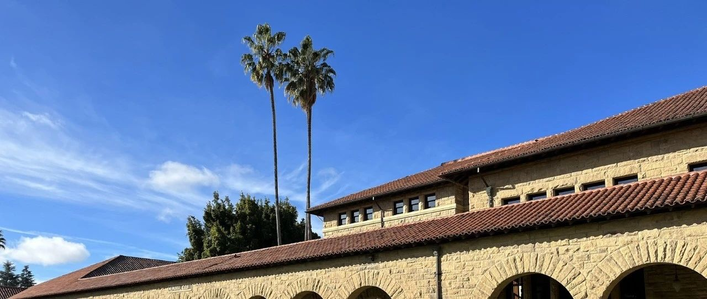
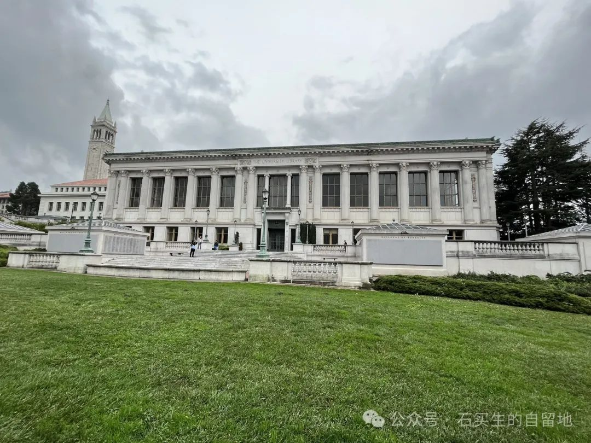
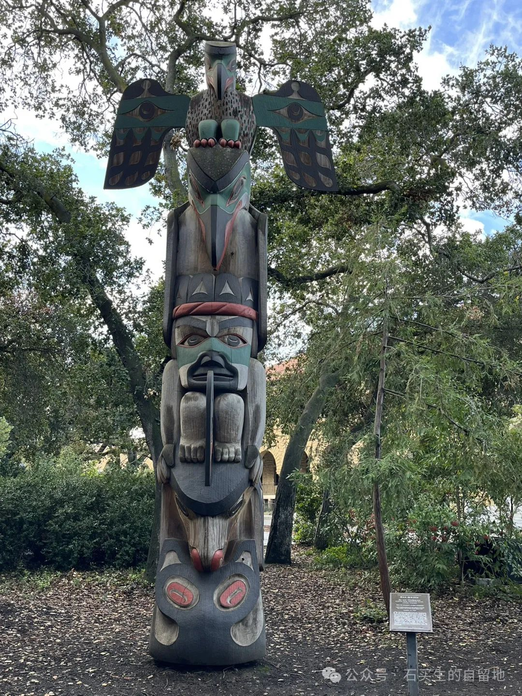
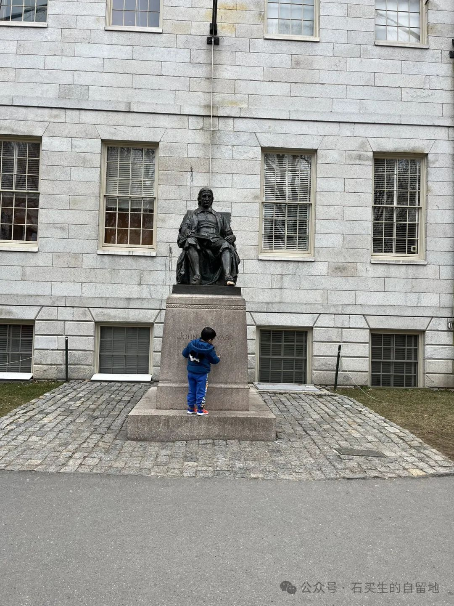
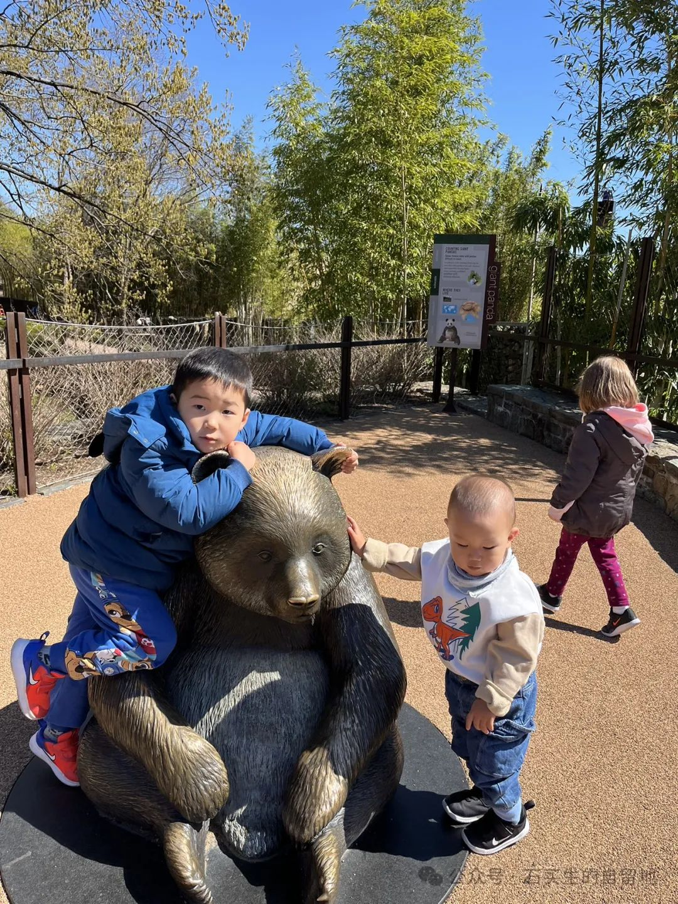
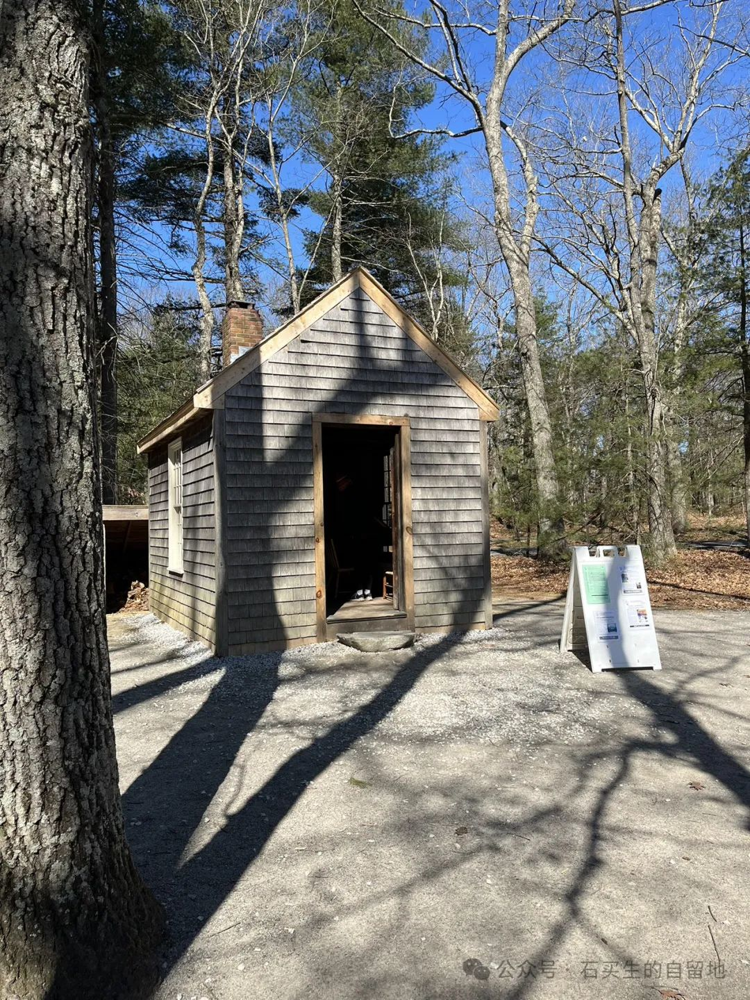

#  在伯克利

原创  石买生  [ 石买生的自留地 ](javascript:void\(0\);)

__ _ _ _ _

​

伯克利图书馆

  

在伯克利

我没有看见

米沃什和穿花裙子的女子

因眼神相互吸引引发出的终极真理

我看见

草坪、图书馆、分叉小径上零散行走的学生

几棵爬满粗藤的老树

钟楼上一片云

正为诺贝尔奖获得者专有车位

低首

​

斯坦福一雕像

  

在斯坦福

有一尊奇特的原始雕塑

马头上坐着一个人

人头正被一只巨鸟大喙吞噬

巨鸟头上又坐着一只鸟

鸟长着人的脚

一双翅膀

像大师的思想一样

不知是  在  沉思

还是  想  飞翔

​

约翰·哈佛牧师雕像

在哈佛

冷峻  是底色。

灰白的天。光秃秃的树。

赭色教学楼  错落有致又  凝重  又  不协调。

冷风

让人越缩越小。

我鼓起勇气

摸了一下约翰·哈佛牧师的脚。

其实

我更  爱校外查尔斯河。

​

国家公园熊猫铜像

  

在华盛顿国家动物园

没有大熊猫的动物园叫什么动物园！”

四岁的QQ充满抱怨。

大象、猎豹、羚羊在他眼里视若无物。

“大熊猫已送回了中国，宝贝！

暑假外公带你去四川看大熊猫。”

Q  Q  一脸疑惑  。

熊猫园中的竹子，矮树，石块，阴凉处的杂草，

在他纯洁的眼睛里都充满了欺骗。

甚至天上的云彩也不是无辜的  。

这个春天肯定有什么东西，在把他小小的心灵伤害。

他  和旺仔  抱着大熊猫铜像久久不愿离开，  无奈

阳光照在他  们  脸上竟留下一片  阴翳。

​

梭罗小木屋

  

梭罗的小木屋

这小木屋不是你的，

屋里的单人床、被子，

窗户边简易书桌，木椅，

墙边上的烤炉，炉外边的储物间，

也不是你的遗物。

这么多年，你不断被世人颂扬

又误解。

最理解你的人早已离世。

今天，人们对你的爱

比不上林间一只松鼠，湖中一片涟漪

天上一缕星光。

远离尘嚣就是逃避自己。

没人知道，

你造的小木屋自成宇宙，

不合时宜的怪人、失眠者、疯子

会成为一面好的镜子。

注：照片系自拍

预览时标签不可点

微信扫一扫  
关注该公众号

****

****

×  分析

__

微信扫一扫可打开此内容，  
使用完整服务

：  ，  ，  ，  ，  ，  ，  ，  ，  ，  ，  ，  ，  。  视频  小程序  赞  ，轻点两下取消赞  在看  ，轻点两下取消在看
分享  留言  收藏  听过

精选留言

贝壳卖房石兰 入户13802907677来自广东

祝石老师身体健康，天天开心！

石买生的自留地来自

谢谢本家，工作顺心，业绩杠杠！[玫瑰][咖啡]

青瓷在土来自广东

每首都喜欢

石买生的自留地来自

谢谢郑老师鼓励！[咖啡][玫瑰]

阳山樵来自广东

石老师都昌人啊？羡慕您退休后的生活！祝您身体健康，万事如意！

石买生的自留地来自

谢谢老乡的问候和祝福！[咖啡][握手]

