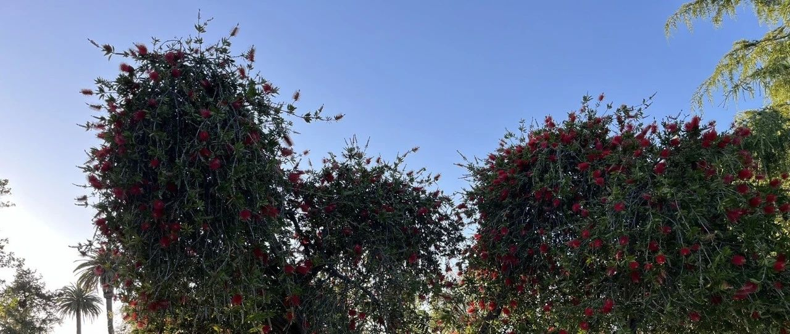
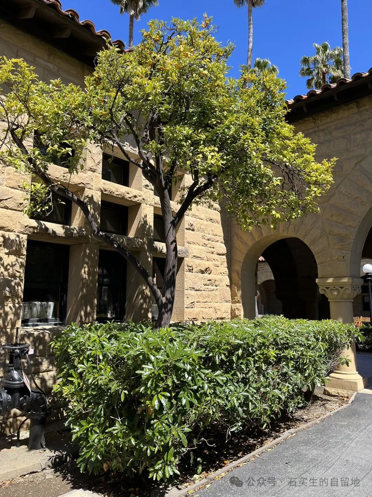
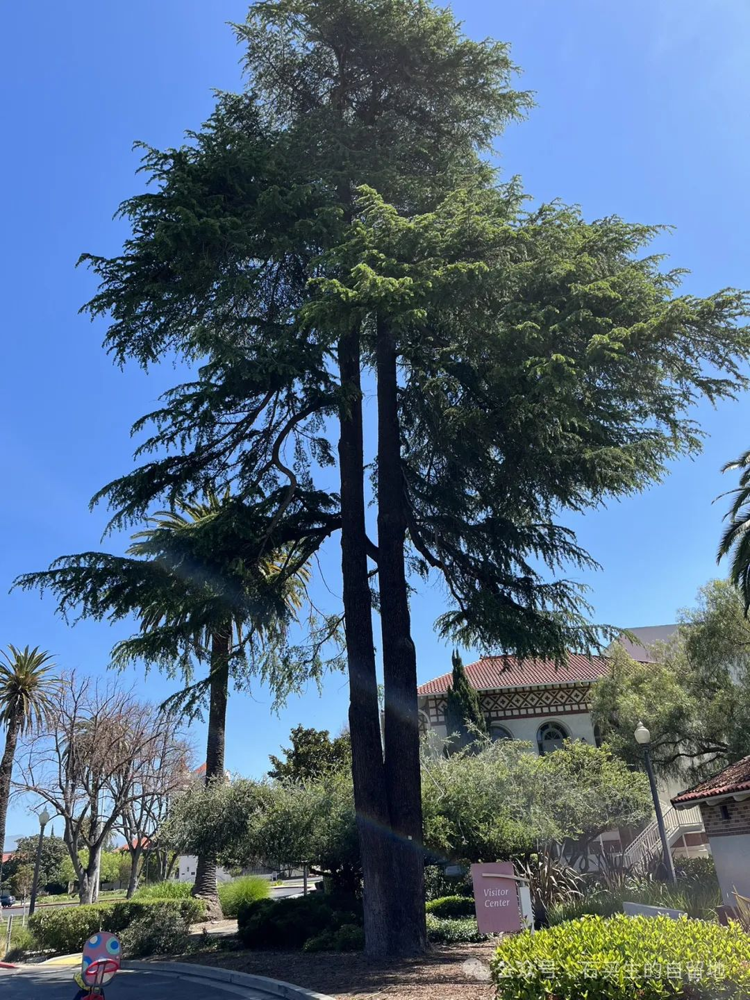
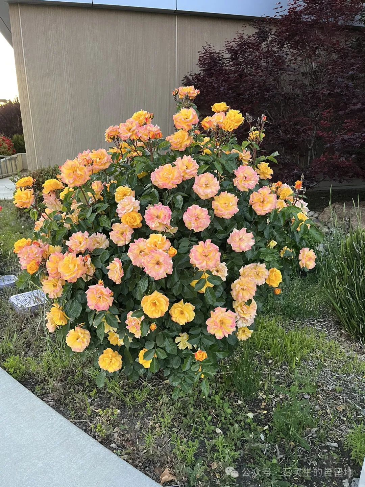
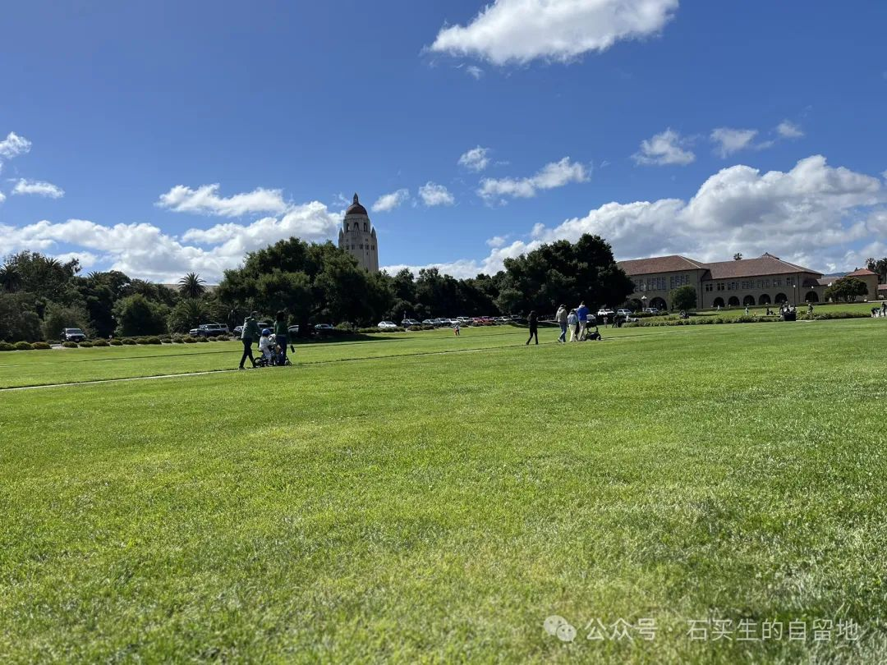
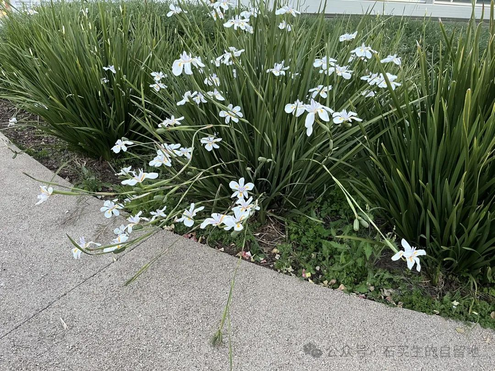

#  散步

原创  石买生  [ 石买生的自留地 ](javascript:void\(0\);)

__ _ _ _ _

​

斯坦福一棵雨树

  

​  

比如

所有的邂逅都指向分离，有一种悲剧之  美。

比如  斯坦福五月的草坪。

小女孩手里的风筝。

小男孩脚下的足球。

青年夫妇手牵着的小黄狗。

不像  觅食的黑鸟。

周日来休闲的各色行人。

移步换景

中轴线上褐色建筑  正亲吻  的  慵懒阳光。

阴翳处  一个  正坐着轮椅  去向厕所的花白胡子老教授。

教学楼旮旯里一棵小雨树

绿叶和小黄果交替闪烁，

似乎在等  平常日子来一个  稀客。

如果你也来了，时间会暂停一下，再停一下。

但是，你也要准备好

这么多美的事物

不  会  告诉你

什么日子  云？  什么日子  雨？

什么日子旧，什么日子新。

它们  目的只有一个：

转瞬即逝。

​

甲骨文公司一景

  

  

偶遇

你怎么也不会想到

就这  个  ，  五月的金色黄昏

甲骨文公司草坪上  竟突现  一只小浣熊

屁颠屁颠爬到公路这边来。

它的样子  灰灰的、笨笨的，煞是可爱。

像极了热恋中的少男少女。

它爬呀爬呀爬到下水道，

一头钻了进去。

它就不告诉你  ，  今天在哪里过夜。

车窗外

这一闪而过的影子

被  我  刚放学的外孙  Q  Q  完美地错过了。

他玫瑰色的日子，

缺了一角。

​

西谷学院的月季

  

  

散步

她总喜欢跟在他后面走  ，  这样

便于看他的丑样子

右脚比左脚更罗圈  更夸张

背差不多弯到  了  7  5  度

个子  越来越矮

比她认识的那么多  矮个子丈夫

还  矮

浑浊的眼珠  ，  除了色

一无是处

头顶上一片霜雪

使她心里头有一种甜柔的接触

左看右看

前面老是一个模糊的影子

3  3  年了，她  看到了  什么  ？验证了什么？

谎言？  欺骗  ？自私？  混蛋？

这些  也许  都是真的。  只是

她看不见

他走在  日光背后的东西

他的眼睛总是游移  ，

圣克拉拉花木参差多态的美

梦中已逝去的亲人的脸

失位的课堂

时光缝隙里的一抹亮光

人性深处的阴暗

身在异国他乡，  魂归何处  的迷茫

总在  在心底低回

在另一个维度激荡，这样的盲目和彷徨

让他的生命更完整

这也是真的·。这世上

还有  更多的真实藏在眼皮底下

更隐秘、甚至更残忍。

需要更多的耐心去发现、体验，

需要耗尽她和他卑微的  一生。

还不够。

​

斯坦福草坪

  

  

疑问

或许  最好的解答，

只需要一场纷纷扬扬的大雪  。

比如

我母亲  或明或暗的一生。

在圣克拉拉闲居大半年了，

我  经常想起一画面：

母亲坐在厨房门口一块青石门槛上，

对着菜园出神。

一坐一整天，  直到蔬菜变陌生，

橘树掉了魂。

桑榆已晚。

母亲在想些什么呢？

难道是-  \--

已经出远门多年的父亲-  \--

那个相依一生

却不爱的人？

母亲  来到韩婆庄做童养媳  ，  只有九岁。

为  了让一个家族走出贫穷与被漠视，她献出了

六十八年的忠诚与良善。

她的悲欢  ，

肯定超过屈原的《天问》。

​

西古学院密申分校鸢尾花

  

  

例  外

我惊叹

西古学院密申分校鸢尾的冷艳之美。

不见一只蜂一只蝶。

对所有来者，

欲迎还拒。

它白色花儿只开在自己的季节里。

自在芬芳，随意零落。

别  处尘埃，此处菩提。

你如果  也选  一个夏日  傍晚  ，

蹀躞前来，

它对你也是这样子的。

没有例外。

这样真好。我们不断伪爱，

不断被抛弃。

注定一辈子

成为忠诚的门外汉。

  
​

注：照片系自拍

预览时标签不可点

微信扫一扫  
关注该公众号

****

****

×  分析

__

微信扫一扫可打开此内容，  
使用完整服务

：  ，  ，  ，  ，  ，  ，  ，  ，  ，  ，  ，  ，  。  视频  小程序  赞  ，轻点两下取消赞  在看  ，轻点两下取消在看
分享  留言  收藏  听过

精选留言

垟来自广东

[玫瑰]买生老师的诗非常动人 文字从眼睛偷渡至灵魂 原来 世界在说话 不用人类的语言；原来 我们可以读懂
不用人类的文字，用有温度的心。我们仍可以表达仍可以传递，用人类的文字、图画和心

石买生的自留地来自

谢谢欧垟赏读哈！的确，诗是沟通人与世界的桥梁[玫瑰][拥抱]

万红梅来自广东

读石老师的这期诗歌，泪眼婆娑！

石买生的自留地来自

[咖啡][握手][拥抱]

吴丰强来自广东

被《散步》打动了[玫瑰][玫瑰]

石买生的自留地来自

谢谢老吴鼓励！[咖啡][玫瑰][握手]

