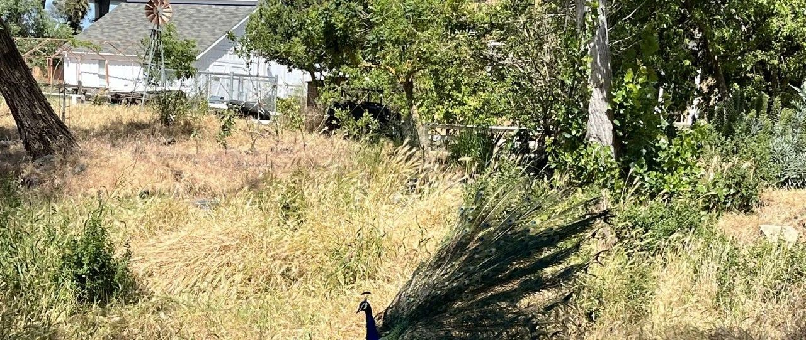
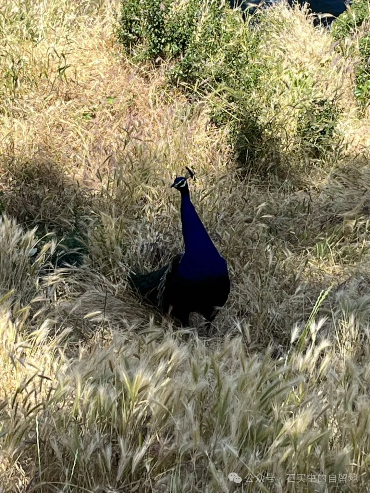

#  六一专辑：献给孩子的诗

原创  石买生  [ 石买生的自留地 ](javascript:void\(0\);)

__ _ _ _ _

甲骨文公司草坪

  

  

六一专辑：献给孩子的诗

猫

小区除了树多，花儿

也到处开。

细而白的六月雪

娇气的皇冠毗邻满地的络石

深红的蔷薇喜欢看

淡黄月季

一点一点零落

这些花

有的越开越美

有的越开越败

有的含苞在等

一只怀孕的猫

从冬青丛中斜逸而出

往草丛而去

她的柔足和身子

被露水打湿

孔雀

在杂草丛中开屏

好像天上掉下一片彩云

孩子们看了看

只是微笑

却不激动

更没有拍手惊呼

这种美他们并不欣赏

他们更喜欢猪

又憨又笨

吃了睡，睡了吃

把他们看痴

乌鸦

大清早

一只大乌鸦从童年的赣北乡村

飞到加州圣何塞

在游泳池前草地上低头觅食

它理也不理，

路边正开着的六瓣鸢尾

彤云一样的月季

老猴一样的

我

气球

成人对孩童的误解

往往理直气壮

4岁多的QQ

正在客厅追打一只无辜的气球

每一拳都打在棉花上

他却自得其乐

见他脸红气喘满头大汗

外婆在一旁呵斥

别疯，别疯！

我在一旁正皱眉

也想开口

上帝却对我耳语：

快亲一下，在脑门！

我恍然大悟，

此时

应该给宝贝颁奖

为他

原始的冲动和纯真

顽皮的小东西

孩童的世界像万花筒

QQ在幼儿园让他老师最头疼

别的小朋友安静，他好动

别人坐着，他跑啊疯

别人一脸乖乖相，他不停装鬼脸。

老师启发同学数字四，

他故意回答三

老师教歌曲挖呀挖

他抢答

挖了个大傻瓜

他在幼儿园最开心的事儿

是看同学看他罚站。

有一回我悄悄问他，宝贝

你最喜欢干什么

他说

我最喜欢干坏事

我一听

嘴巴都笑歪了，像女孩子

羞羞答答

  

圣克拉拉一公园孔雀

  

注：照片系自拍

  

预览时标签不可点

微信扫一扫  
关注该公众号

****

****

×  分析

__

微信扫一扫可打开此内容，  
使用完整服务

：  ，  ，  ，  ，  ，  ，  ，  ，  ，  ，  ，  ，  。  视频  小程序  赞  ，轻点两下取消赞  在看  ，轻点两下取消在看
分享  留言  收藏  听过

