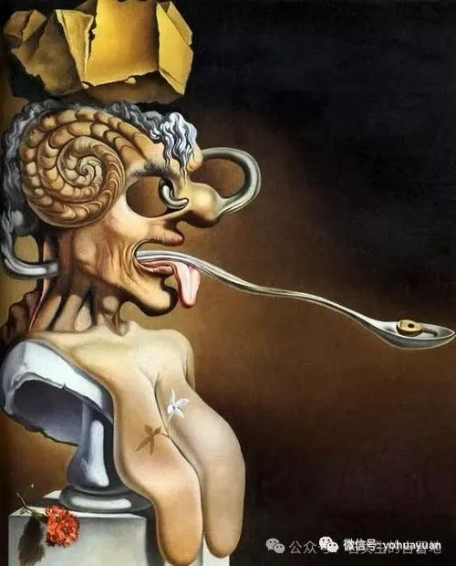
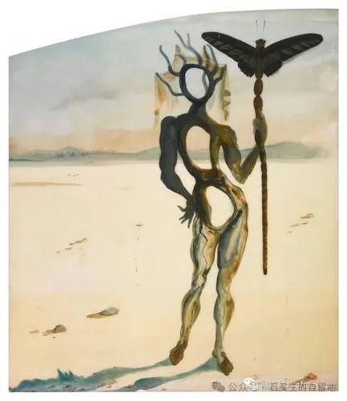
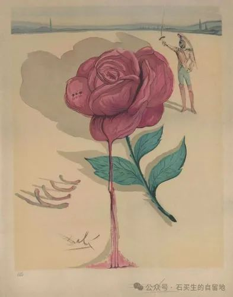

#  告家长书

原创  石买生  [ 石买生的自留地 ](javascript:void\(0\);)

__ _ _ _ _

达利名画

  

告家长书

一年一度高考季又到了。家长、学校、老师、学生都高度紧张。献上一支阿根达斯，一瓶冰镇汽水，一盒抹茶冰激凌。给大家降降温，轻松一下气氛。

\-----题记

怼尼采

尼采说

教育让学生学会了厌倦

NO

在学校

除了接受，就是服从

字典里

只有是

没有否

这样也有好处

从此

一辈子

不知道该干什么

更不知

为何而活

2024.6.4 圣克拉拉

达利名画

  

新师说

师者

精通矛盾修辞学的

隐形杀手

且

不自知

一向口是心非

表里不一

含英咀华

尽吐糟粕

擅长

让溢满书香的红楼

变成

惩罚性建筑

相信

N次深夜灯火

胜过

一次壮丽日出

拿手好戏

是戕害

纯真心灵

让知识左耳进

右耳出

春风化雨时

天性没了

自我

彻底迷失

爱

没教会

恨

却结了果子---

“多考一分，

干掉千人！“

这口号

变态又豪迈

在天地间

回荡

让天上的月亮

又多了一份

阴冷

2024.6.3 圣克拉拉

达利名画

告家长书

家长们

你们好哇

你们最大的错误

是和学校合谋

把孩子塑造成你们

希望的样子

结果

鲜嫩的花朵

枯萎零落

变得不成样子

你们灌输

成功的迷魂药

结果

孩子咀嚼到苦涩

和失败

你们整日癫狂

渴望下一代

出人头地

结果

一个个微小

如尘埃

你们巴望每一天

都看到奇迹

结果

他们的日子枯燥

且不断重复

每一天

都是灰色的

你们

想看到梦的延续

结果

双重被打击

日子除了灰色

还有点黑

你们得了世纪之病

又盲目又执迷

请早点治哈

啥时醒悟都不迟

把孩子还给孩子

让自己成为自己

顺应自然规律

懂天道

通人性

不越俎代庖

不揠苗助长

请相信

不管小草还是大树

都自成宇宙

在不确定时代

独立为第一要着

你们要真好啊

放下绳子

做好自己

2024.5.4 圣克拉拉

  

  

注：图片来自网络

  

预览时标签不可点

微信扫一扫  
关注该公众号

****

****

×  分析

__

微信扫一扫可打开此内容，  
使用完整服务

：  ，  ，  ，  ，  ，  ，  ，  ，  ，  ，  ，  ，  。  视频  小程序  赞  ，轻点两下取消赞  在看  ，轻点两下取消在看
分享  留言  收藏  听过

