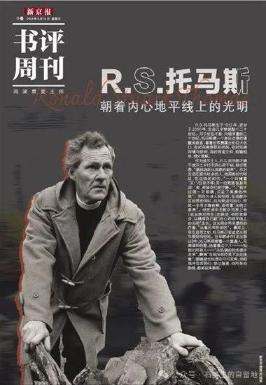
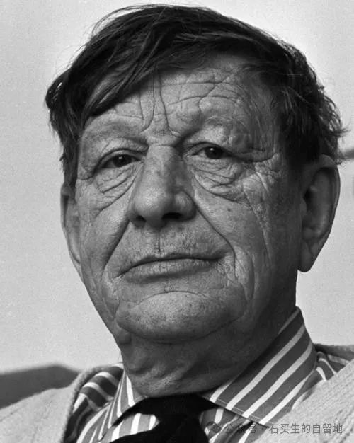

#  经典重温

庞德 等  [ 石买生的自留地 ](javascript:void\(0\);)

__ _ _ _ _

埃兹拉·庞德 美国著名诗人

  

委任

【美】埃兹拉·庞德

去吧，我的歌，走向孤独者，走向不满者，

也走向心烦意乱的人，走向被习俗奴役的人，

给他们带去我对压迫他们的人的鄙视。

去吧，像巨浪带去清凉的水，

带去我对压迫者的鄙视。

你要讲话，反对不自觉的压迫，

反对无想象力者的暴政，

反对一切束缚。

你要走向腻烦得要死的布尔乔亚，

走向住在郊区的妇女，

走向可怕地结了婚的人，

走向把失败隐藏起来的人，

走向那些配非其人的人，

走向买来的妻子，

走向法定属于别人的女人。

你要走向情欲细腻的人，

走向细腻的欲望受挫的人，

走向枯燥无聊的世界，像一场灾难；

去吧，把你的刀锋对准这种枯燥，

拉紧纤巧的绳索，

把信心带给灵魂的海藻和触须。

去吧，态度友好地，

谈话直率地。

要热心于发现新的罪恶，新的美德，

要反对一切形式的压迫。

去吧，走向那些中年变迟钝的人，

走向那些丧失了兴趣的人。

走向被家庭窒息的少年，

哦，多可怕，

看到一家三代人聚在一起！

就好像一株老树抽出新芽，

都还挂着腐烂零落的残枝。

走出去，藐视一切意见，

反对把热血停滞地捆束起来，

反抗一切传统势力。

R·S托马斯 威尔士著名诗人

礼物

R.S  托马斯

从父亲那里，我继承坚强的心脏，

消化不良的胃。

从母亲那里，我得到恐惧。

从悲伤的国家，我得到耻辱。

我所有的一切都给我的妻子

除了爱

那是我唯一不能给予的。

给唯一的儿子，饥饿。

  

威斯坦·休·奥登 英国著名诗人

爱得更多的那个人

仰望星空，我很清楚

那些，他们所在乎的，我可以下地狱，

但是在这个世界上，我们最不必害怕的是

来自人或者野兽的冷漠。

我们应如何喜爱，当群星为我们热情的燃烧

而我们则无法回馈？

如果爱，无法对等，

让我成为爱得更多的那个人。

尽管我认为我是群星的仰慕者

但是它们却毫不在乎，

我此刻看着它们，

却无法说出我整天所思念的那个人。

如果所有的星辰都消逝或灭亡，

我应该学会去仰望空荡荡的星空，

感受它彻底并崇高的黑暗，

虽然这需要让我花些时间。

注：照片来自网络  

预览时标签不可点

微信扫一扫  
关注该公众号

****

****

×  分析

__

微信扫一扫可打开此内容，  
使用完整服务

：  ，  ，  ，  ，  ，  ，  ，  ，  ，  ，  ，  ，  。  视频  小程序  赞  ，轻点两下取消赞  在看  ，轻点两下取消在看
分享  留言  收藏  听过

精选留言

