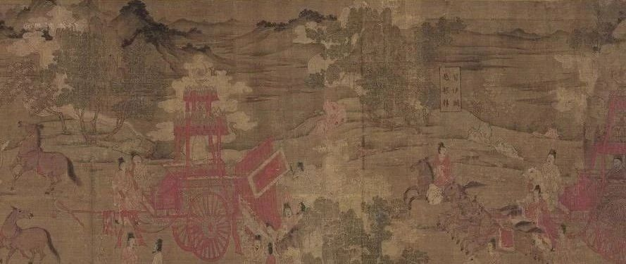
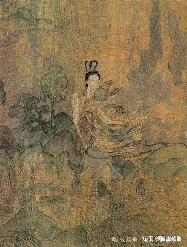
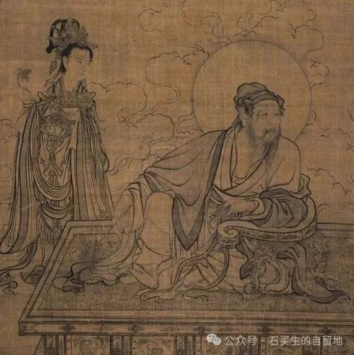

#  幽暗的火

原创  石买生  [ 石买生的自留地 ](javascript:void\(0\);)

__ _ _ _ _

顾恺之名画

  

幽暗的火

  

回国十天了。最惊讶

那个漠视我的美人香消玉殒

  

她把DNA和隐晦不明的时光

留给了街角的某个冷美人

  

蝴蝶兰，在凯悦酒店一楼

通向二楼扶梯转角

  

与我擦肩而过，夏日的辉煌

败于它缕缕暗香

  

我又走在无常里，泳池里碧波

荡漾，像无数张脸在闪烁

  

不管是迎接还是闪躲，总有

幽暗的火在改变日子的颜色

2024-08-12  东莞

  

顾恺之名画

  

醒着

—-与卫平兄

  

那个在水边入你梦的糊涂人

其实一直都醒着

  

他跟你一样终生抱着虚无药罐

比这个时代更需疗伤

  

你不合时宜寻找童年的弹弓

他抱残守缺总在阴影里沉浮

  

你客居南山抚琴吹箫，和友人

踏雪寻梅，你一次次

  

重回魏晋，用清谈表达

骨子里的猖狂，他在异乡一次次

  

颔首，沉迷于古老的炼丹术

任亲友视作怪人或不可救药

  

你们都成了辛波斯卡门徒，

在混乱时代，写诗，用荒谬对抗荒谬

  

2024-08-15  东莞

  

  

附：卫平兄赠诗

  

记梦

曲旦

  

在水边遇见买生兄

涨起的水淹没了一座公园

他刚从东莞退休，去了一趟美国

他说文学不可靠涨水不值得害怕

  

穿着一双白网鞋  他走入水中，

越走越远水深及腰时，他折身上岸

一只鞋不见了，另一只留在岸上

他光着脚离去

  

我追上去，端详那只沾满淤泥的鞋

依稀可见几行字迹娟秀的诗句

像是写给他的

又像是写给东莞的

  

无论是他，还是东莞

都已承载不起这份灼热

  

2024.8.6晨起记梦

  

  

注：图片来自网络

预览时标签不可点

微信扫一扫  
关注该公众号

****

****

×  分析

__

微信扫一扫可打开此内容，  
使用完整服务

：  ，  ，  ，  ，  ，  ，  ，  ，  ，  ，  ，  ，  。  视频  小程序  赞  ，轻点两下取消赞  在看  ，轻点两下取消在看
分享  留言  收藏  听过

精选留言

龚思来自甘肃

大千世界，美丽已死。然而，先生的诗作如久去而返的夏夜之萤，在传递光。

石买生的自留地来自

诗意之心尚在 ,世界之光犹存。[玫瑰][握手]

曙光来自广东

这两首诗确实精彩！

冠辉～ray来自广东

老师，有在东莞吗

戒定生慧来自广东

喜欢石老师给卫平的诗歌[玫瑰][玫瑰][玫瑰]

石买生的自留地来自

谢谢海龙喜欢！[拥抱][玫瑰]

吴丰强来自广东

好诗！！[玫瑰][玫瑰][玫瑰]

石买生的自留地来自

谢谢老吴鼓励！[咖啡][握手]

