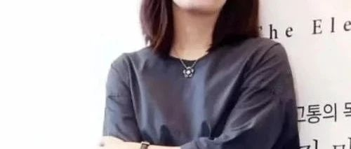
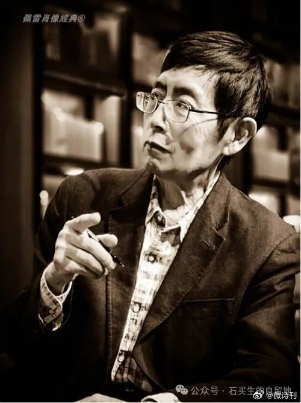

#  韩江是一颗酸葡萄吗？

原创  石买生  [ 石买生的自留地 ](javascript:void\(0\);)

__ _ _ _ _

韩江是一颗酸葡萄吗？

  

自韩国女作家韩江10月10号获得诺贝尔文学奖以来，网上很多帖子说韩江的诗放在中国，顶多算作三流。我不知道这种无脑贬损一位诺奖新贵是为了博取流量，还是一时为了过过嘴瘾，我觉得这种哗众取宠的做派，往轻里说是一种无知的盲目自信，往重里说是对诗歌和诺奖缺乏起码的尊重。

我有幸读到中国当代好些一流诗人的一流作品。北岛多次被提名为诺贝尔文学奖候选人，其作品也得到世界认可。我想引用北岛一首诗《回答》和韩江一首诗《某个深夜的我》做个比照，看看韩江的诗跟中国最牛逼的诗人的诗相比，是不是真的属于三流，请看诗：

  

诗人北岛

  

一切

北岛

  

一切都是命运

一切都是烟云

一切都是没有结局的开始

一切都是稍纵即逝的追寻

一切欢乐都没有微笑

一切苦难都没有泪痕

一切语言都是重复

一切交往都是初逢

一切爱情都在心里

一切往事都在梦中

一切希望都带着注释

一切信仰都带着呻吟

一切爆发都有片刻的宁静

一切死亡都有冗长的回声

《一切》是最能代表北岛风格的代表作之一。浓郁的情感，强烈的反思与批判精神，格言式的警句迭出，粘贴画式彰显了一代人伤痕累累累的生活印记，发出了文革那一代青年的沉痛呐喊。因为声音如此真切、深刻，北岛的诗歌也成为了那个时代的最强音，他也因为诗成为了一个时代的代言人。此种智性诗歌也为当代中国新文学在世界文坛赢得了尊严。

  

作家韩江

  

某个深夜的我

韩江

  

某一个深夜

我凝视着

从白色碗里的米饭上方

升起的腾腾热气

那时我才知道

有什么已永远过去

此刻也是一样

永远地在流逝当中

该吃饭了

我把饭吃了

  

韩江的《某个深夜的我》，初读平淡、寡味，看似写了一件平常小事。深夜，诗人看着一碗冒着热气的饭，把饭吃了。读这样的诗，跟喝一杯白开水没区别呀。但是且慢，现代诗歌的魅力之一，就是平淡无奇的文字背后，隐藏着人生诸多小奥秘，深婉中常有独特的韵致。回看这诗，注意题目中“深夜“二字，按常理，一般人深夜了干什么？睡觉啊。可诗人深夜才吃饭，这一天过的是什么样苦逼的日子呀。原来草民生命的异化，是从一碗饭、生活没有规律开始。再看诗第二句中的”凝望”二字，一天辛苦，饥肠辘辘，有饭赶快吃呀，为啥要凝望呢？这不是没事找事，不是有病吗？读者诸君，不是这样子的。原来呀，诗人疲惫的双眼看见了白米饭冒出腾腾热气，她希望时间慢下来，甚至暂停一下，好让她疲倦的身体和来不及喘息的灵魂，休憩一下。哪怕只休息片刻，再品尝美食不迟。但想到眼前米饭冒出的腾腾热气，自己娇弱的身体，抓也抓不住的转瞬即逝的片刻，此时最正确、最庄严的选择，就是毫不犹豫把饭吃了！因为米饭、热气、时间、生命稍纵即逝，我们只有珍惜，才能拥有生命的不堪与罅隙。尽管这不堪与罅隙是这么苦涩，但我们每个人还是想成为希腊神话中西西弗斯。

所以这首诗，韩江探索的主题可能是“珍惜”，以及潦草不堪的命运在时间中的位置。韩国总统尹锡悦也高度赞扬韩江“将韩国现代史上的痛苦和伤痛升华为伟大的文学作品。”我看，《某个深夜的我》是她伟大文学作品中的一个音符。

孔圣人从河水中感觉到时间“逝者如斯夫！”韩江从米饭腾腾热气上感觉到时间在流逝。正是因为哲人和诗人，我们卑微的生命才多了一个维度。

北岛的诗，用理性的沉思感知命运的跌宕，汉江的诗，用感性的触角回应生命的呼吸。在日益多元的现代诗歌园地里，它们都是不同时代绽放出的奇葩！

通过此种比照，还有谁认为韩江的诗在中国算三流，韩江这个人是一颗酸葡萄吗？

  

  

  

注：图片来自网络

  

预览时标签不可点

修改于

微信扫一扫  
关注该公众号

****

****

×  分析

__

微信扫一扫可打开此内容，  
使用完整服务

：  ，  ，  ，  ，  ，  ，  ，  ，  ，  ，  ，  ，  。  视频  小程序  赞  ，轻点两下取消赞  在看  ，轻点两下取消在看
分享  留言  收藏  听过

