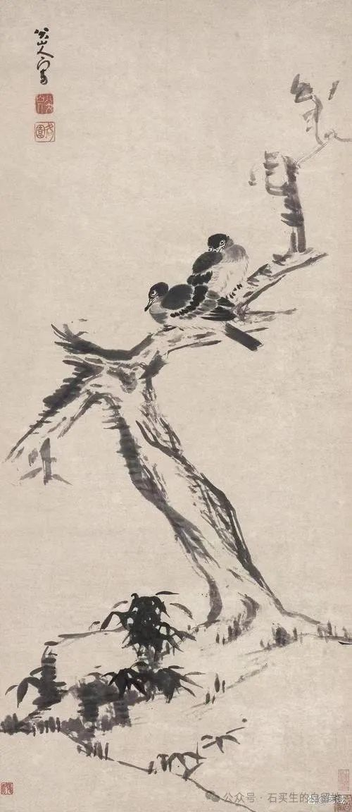
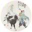

#  访友记

原创  石买生  [ 石买生的自留地 ](javascript:void\(0\);)

__ _ _ _ _

朱耷名画

  

访友记

暮年造访老友

这像是在找回失散多年的自己

在南沙

我和沈凌兄陷入生涩而迟滞的回忆

往事如雪泥鸿爪

怎么勾勒都只留下风的影子

沙发上对坐

忌讳多于剩下的爱

古老的木筏上

已载来隔代天使

笑如下弦月

苍黄中带着洁白

镂空的方形菱形壁柜上

泥塑木雕根雕陶瓷工艺品

各立一隅

正对沈兄含情脉脉

窗外能看见珠江支流在天底下静卧

零星船舶好像沉睡多年

小区和整个岛

在午后的日光里惺忪欲寐

绿草茵茵黄叶飘零

我打趣沈兄

享受安静成了世外高人

他自嘲远离红尘

早已是野鬼孤魂

小区大门口

庆祝国庆的红旗猎猎作响

两个老头走在风中

像闪烁不定的音符

一个留在海角

一个飘向天涯

自拍照

云遮月

因绝望

韩江将一个女人

变为素食者

继而令她绝食

想让她

变成一棵倒立的树

树未变成

女人就死了

只留下

弦断了的锦瑟

余音袅袅

树杈间的月儿

听闻此声

打一个寒颤儿

将苍白脸蛋

藏在云间

朱耷名画

  

新型旅店

这辈子干的最愚蠢的事

是将乡下老屋推倒

花大价钱

再建了一栋新房子

新房子确实漂亮

但常年空着

即使住

也是因为清明节中元节

在爷娘坟前和屋后

看纸钱的灰

轻扬

  

  

注：图片来自网络、自拍

预览时标签不可点

微信扫一扫  
关注该公众号

****

****

×  分析

__

微信扫一扫可打开此内容，  
使用完整服务

：  ，  ，  ，  ，  ，  ，  ，  ，  ，  ，  ，  ，  。  视频  小程序  赞  ，轻点两下取消赞  在看  ，轻点两下取消在看
分享  留言  收藏  听过

精选留言

老石来自广东

哥:重建的老屋是你和故土之间那条若隐若现的线，如果老屋只剩下断壁残垣，也就断了来处的念想，回见也只增伤悲而已。 愚弟拙见，哥一笑置之即可！

石买生的自留地来自

老四言之有理。[握手][玫瑰]

吴丰强来自广东

《访友记》真好，暮年的感觉零星而深刻，“苍黄中带着洁白”，读来爱不释手！[玫瑰][玫瑰][玫瑰]

石买生的自留地来自

谢老吴鼓励，拙诗一般般。[玫瑰][咖啡][握手]

老灯来自江西

好好好！[鼓掌][鼓掌][鼓掌][鼓掌]

