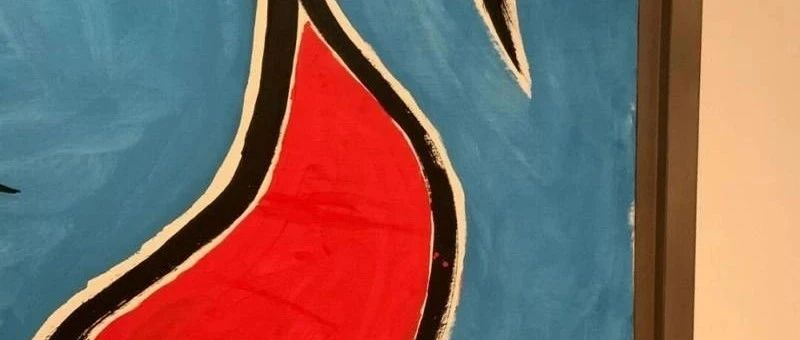
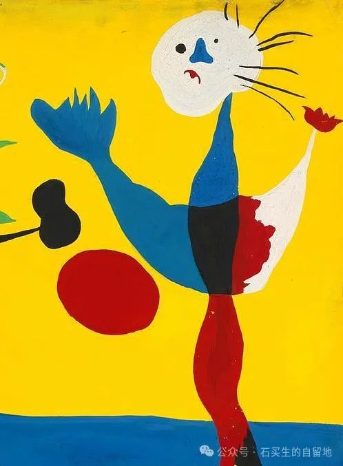
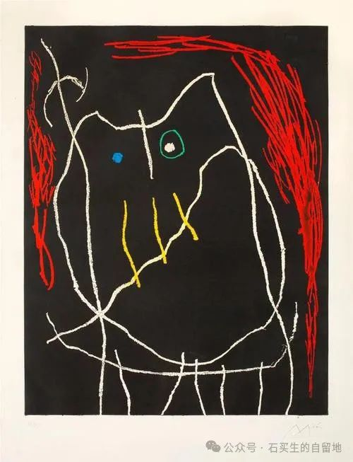
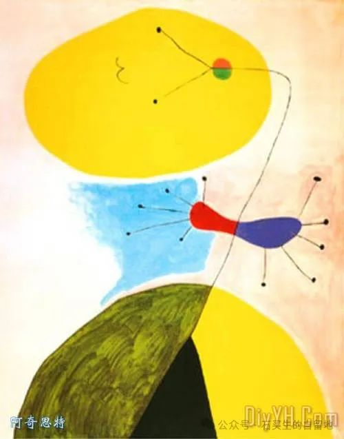
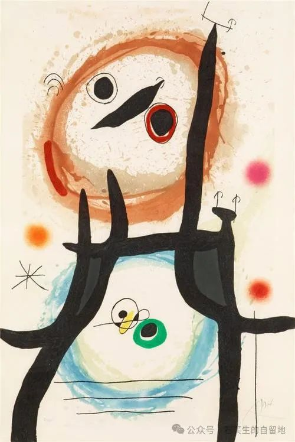
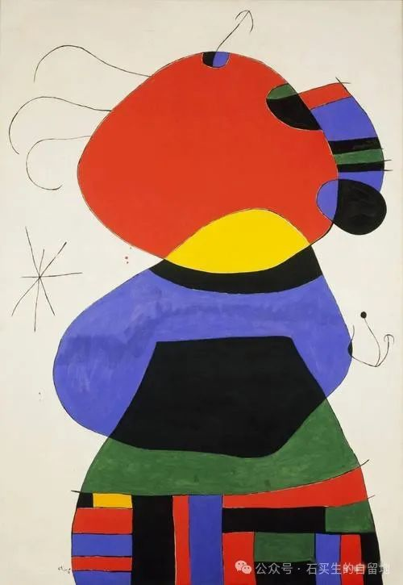

#  青春五彩斑斓

原创  石买生  [ 石买生的自留地 ](javascript:void\(0\);)

__ _ _ _ _

青春五彩斑斓

\-----东莞中学松山湖学校2024级高一（14）（15）班周记选

米罗名画

鸽子

高一（14）班  何  霆  熙

有一天,有一个男孩,他  收养  了一只鸽子,他很喜欢这只鸽子  。  一天,鸽子不见了,母亲说,它就在你昨天喝的汤里  。  男孩扑在床上,放声大哭,
为昨天的汤感到恶心。  因他的鸽子感到悲伤,感到痛苦  。
五分钟后,他开始思考,他意识到自己的悲伤出于一种空洞的同情,他对鸽子汤的恶心是出于世俗的礼节,他对鸽子的情感只是高高在上的怜悯  。
鸽子的死因便有了:弱肉强食  。  他开始为人类的伪善感到恶心,为自己感到悲伤,感到痛苦  。  他思考着这些深奥的问题,忘记了自己逝去的鸽子  。

我想做的事

高一（14）班  张家瑞

我有很多神奇的想法  。

我有时候会想,在狂风暴雨下奔跑,顶着风的冲击和雨的击打,步步前进,以示我的力量  ，  然后放开全身,任风雨把我吹得东倒西歪,可我仍立于此  。

我有时候会想,沉浸在深海之中,感受着海面上的一切离我愈来愈远,落入一片黑暗与死寂,什么也不用管,肉体的压力充斥着,然后精神去  往  了轻松的世界  。

我有时候会想,走上早晨八九点的阳光铺在石子路上,温暖拂过我的身体,然后再一下子倒在路边柔软的草地上,叶片上的露珠一定会让我感到很刺激,然后在缓缓升高的太阳下,让露水浸润全身。

我想一个人,但我更想有一双可以紧握住的手,奔跑在暴风雨中,沉溺于海底,亦或是漫步于晨曦之下  。

米罗名画

叠被风波

高一（14）班  王熙  恩

周一,曙光初照,我心怀热忱,悉心折叠被  子  ,再三整理,满以为能达标,却被判定"未折被子"而惨遭扣分,此判罚完全  令  人膛目结舌  。
周二,我不敢有丝毫疏懒  ，  全神贯注,精心叠放,反复摩挲,自觉已臻完美  ，  怎奈扣分依旧如影随形  。  周三被子摆放方向不对  ，  便  视
作大过  。  周四,仅因枕头些许歪斜,又被无情判决  。  叠被子,本应是开启良好生活习性的一把钥匙,是个人自我约束与规整的具体映射,  一
方整洁的床铺,能够构筑惬意的休憩港湾,亦能折射积极向上的风貌  。  然而,现今对于叠被子的种种要求,却早已逾  越  了应有的边界,蜕变成为对  莘莘学子
的苛酷刁难  。  学校重视生活习惯塑造,初衷固然值得嘉许,可这般日复一日、锱铢必较的检查与扣分机制,无疑是对学生生活的肆意侵扰  。
它无情压缩学生自由维度,漠视个体间的独特性与现实生活的多样性  。

此般过度管束行径,深刻映照出教育理念中因循守旧,刻板僵化的沉疴  。  教育的真谛在于引领学生全方位成长,  培
养独立与自主创新的精神,绝非凭借机械刻板的单一标准去妄加评判与桎梏束缚  。  当下迫切需要重新审慎  考
量此类规则的合宜性与正当性,让叠被之类的要求归位  至  适宜  合  理的引导空间  。
如此,学生方能在遵循基本生活的根基上,有余裕与心境去探寻知识的广袤天地,全方位提升自我  素  养,于自由与规则之间找寻精  妙
的平衡点,真切达成身心的健康成长与个性的充分舒张,而非在失当的规制囚笼中压抑自我,身心俱备  。
毕竞教育的场域应是自由与秩序和谐共生,而非冰冷规则的独舞之地  。

追小人物的月

\---  \--《亮与六便士》读后

高一（14）班 巫乐怡

斯特里克兰追月旅程传奇、独特,但过于理想化,不适合我们普通人,离我过于遥远  。  因此,相比  传
奇的斯特里克兰的追月之旅,我更中意书中篇幅短小的.失败的施特洛夫  。

施特洛夫在绘画上有点天赋,但又未到惊才绝艳的程度,在众多画家中只是能算  得  上平平无奇  。
即使如此,他也怀揣着梦想.像许多带着心中的梦想的年轻人一样,走出小村庄到大城市闯荡,只是结局不那么的美好,施特洛夫和错误的人在一起  ，
经历了一段错误的婚姻,与斯特里克兰相处却换不出对方的真心  。  载着满腔的热情来,拎着  失败
的梦想去,这是他的悲剧,但我觉得悲剧才是生活的常态,实现梦想的喜悦只是少部分人的专利  。

梦想之所以称之为梦想,  月  亮之所以被人们向往,正是因为它们都是同样的遥不可及  。
追梦之旅漫长且艰难,一般人都会像施特洛夫一样带着遗憾结束这段旅程,但对实现不了的梦想的我们来说,在经历了一番挨打滚爬后蓦然回首,发现没有这么多热情、甚至有些平淡的平凡生活也是这么的美好,不也是一种难得的胜利吗?

笑过,才更懂得珍惜,曾为梦想努力拼博的人,才更可以更深刻地领悟到生活中的美好,施特洛夫的追月旅途戛然而  止，
不是失败,只是在明亮的月光中找到了自己真正能攥紧在手中的六便士,那是更实在的东西,也是我们真正能把握的事务  。
回归生活,享受生活才是更能被众人所接受的道路.

在逐月中失败而归,拾起脚下的六便士,  像  施特洛夫  一  样在跌倒  后  回归当下  ，  才是我心中更适合我的追月之旅  。

米罗名画

何时等到葡萄成熟时?

高一（15）班  陈钰  荣

在周末的一个晚上,我如同往常般躺在床上,安静地享受着音乐时间  。  猛然间,我便被一首歌的歌词所吸引  。
《葡萄成熟时》,一首在粤语地区传唱度比较广的歌曲,因为开头的一句"差不多冬至,一早一晚还是有雨  ”
被人们称为冬至神曲.平时的我并没有太关注到歌词,亦或是说一直不懂得歌词的意思.但这次我被它的歌词所  震憾  到。

在我的理解里,歌词包含着爱情与人生。

先讲爱情吧.爱情这个话题在高中里仿佛就是一个禁忌,在高中恋爱成为一个敏感的话题.在词中,作词人将追求爱情的过程比作成栽种葡萄的过程.你每天用心去经营它,呵护它,但到了
丰  收的月份的时候,结果并不是那么如意  。  你看着晚辈们丰收的成果比你好,看着周围的人纷纷在炫耀,你的心里很不是滋味  。
在经历了几番思考后你明白了  ，  葡萄需要时间和耐心去培育等待才能成熟,爱情也亦是如此  。  "你要静候,再静候,就算失守,始终要守"  ，
人们在爱情道路上有着执着和坚定,即使面对挫折和不确定,也不轻易放弃对真爱的期待!

在歌词的末尾部尾分,声调升高  ，  "想想天的一边亦有个某  某  在等候,一心只等葡萄熟透尝杯酒"  ，
即使自己之前在情感方面并不好,但仍相信在世界的某个角落有着一位能与自己契合的人,终会迎来属于自己的成熟爱情,就像等待葡萄成熟酿成美酒一样  。
同时在这首歌中也含有大部分爱情歌曲没有的人生部分.人生的成长与收获也需要面临着风雨和挫折.葡萄的成长过程需要经历风雨,阳光等各种考验,才能成熟  。
与人的成长相似,但也只有经历了这些才能不断积累经验和智慧,实现人生的成长和收获,将挫折当作人生中的宝贵财富,才能让自己变得更加成熟  。

人生要把握好时机."也许丰收月份尚  未  到你也得接受,或者要到你将爱酿成醇酒时机先至熟透"  ，
当你人生时机来到时,可能你再怎么努力也得不到一个很满意的结果  。  这意味着我们需要有着足够的耐心和定力,不断提升自己等待着机会的到来  。
我对歌词的理解已经结束,随着年龄的增长,我似乎也能逐渐理解一些之前并不能明白的事物  。

米罗名画

  

躺在床上想的事

高一（15）班  郑  晴  文

从学校回到家,从家门口走到客厅,从客厅走到我的房间,打开房门  ，  按下墙上的开关,瞬间整个房间被  温  暖的灯光笼罩,我一身的疲惫和压力被这灯光驱散
。  随  手  将重如泰山的书包甩到地上,  便  一个大跳,优雅地跃起,扑进我美丽无  比  的床里  。

为什么是扑进床里?因为床实在太软了  。  扑到上面的瞬间,我便被丝  滑
而柔软的被子从四面八方包裹,好像落入了一个甜密的陷阱,里面充满诱惑的美梦,叫人甘愿沉沦于此,再不愿清醒,不愿挣脱,不愿从这张床上起来  。

我趴着,懒懒又换了一个姿势  。  闭眼,仰面躺在床上,仿佛每一根  筋络  ,每一块肌肉都尽情  舒  展,每一个细胞  都
自由呼吸.没有压力,没有辛苦,只有无尽温柔绵延  。

太舒服了.

就让我死在这张床上吧,一瞬我这么想  。

也许未来我会和这张床结婚.脑海中昏沉,也许这样挺不错的  。

夜幕  深沉  ,妈妈走进来帮我关了灯  。

房间里安宁又静谧,听得见窗外风声低语.一丝光线从窗帘的缝隙漏进来,它作为这黑暗的点缀,一点没有喧宾夺主的意味  。

宇宙....伊甸  园  .....哲学.....任由思维发散,飘到不知何处的远方.困意翻涌,脑海逐渐放空  。

愿时间在这一刻永远定格,我愿意就这样.就这样.沉睡永远,直至人间荒芜,清风带走一切.

生命永恒,宇宙不朽。

逝者眼中的现实

与现实的荒诞相比,小说的荒诞真是小巫见大巫.  \-  \----  题记

高一（15）班  谢  宜  睿

本周我抽空阅读了余华的《第七天》  。  以前我读过他的《活着》与《兄弟》,感叹到这又是一部更加荒诞却又更如现实的小说  。

这部小说的叙事角度十分独特,本  书  的主人公杨飞,在一家餐厅吃饭时由于厨房爆炸而死  。
讲述了他在死后七天的所见所闻,现实与记忆交错.文中有两条线,一条是杨飞死后寻找他父亲,第二条是他在寻找过程中的所见所闻,遇到了他的前妻李青,谭家鑫家,"鼠妹"刘妹,李月珍等
。  虽是讲述在阴间的故事,却处处反映着人间,诉说着善与恶  。

这本书讽刺了很多现实的黑暗.主角杨飞死后在殡仪馆排队等候烧尸的时候,逝者在谈论自己死后的  去  处  。
普通人穿着普通的寿衣,用着廉价的骨灰盒,甚至有的都  没  有墓地  。  而那些生前富贵的人,死  后
穿着丝绸的亮丽的寿衣,坐在贵宾VIP区,死后的墓地一月租金二十三万,骨灰盒是龙宫,蟾宫一类  。  足以可见人与人之间的差异巨大  。
杨飞更加可怜,一个悼念的都  没  有,死后没有去处,没有寿衣,在自己的手臂上绑黑纱来自我悼念  。

但这里我也见到许多人间的温情  。  主角杨飞小时候被亲妈遗忘在铁轨处被一名路过的  扳  道工杨金彪捡到  。  他对杨飞无微不至的关怀  。
后来,杨金彪认识了一位姑娘,在与杨飞的选择中,他放弃了婚姻.长大杨飞与亲妈相认,杨金彪掏出几千  块
为儿子买西装,他身上本就不多钱,却几乎全部奉献给了儿子  。  当他看到儿子光鲜亮丽的时候,他也由衷的为儿子高兴.当他身患绝症时选择不  拖累
杨飞,独自离去  。

在这个彼岸与现实交错的故事里,每一个细节都被放大.现实中的黑暗,一个普通人内心的波涛汹涌  ，
在此刻都被放大,更加让我感受到了社会中的真实.但尽管这样,我们还是要努力地好好生活,不能放弃希望  。  至少在死后,还要有人为你的逝去而悲伤  。

不入海的河

高一（15）班  万栩枫

我不去想

河流会流向哪里

因为我知道

它还是条河流

河流不就流入大海吗

我不知道

因为我知道

它还在永不止息地流

米罗名画

  

漂流瓶

高一（15）班  一甄清岚

秋天,是一个让人想要写信的季节  。

漂流瓶活动是高中文学社举办的,可以给其他学校的同学寄信  。

写信的过程耗费了不少时间,却让我感到很值得  。  每写一封信都迫使我不断回忆与朋友们的点点滴滴,  斟  酌即将写下的  词  句  。
回忆的过程中让我想起了许多趣事,原来当时认为微不足道玩笑一直记到了现在,从前被考试蒙蔽的双眼渐渐明亮了起来,我才真正看清陪伴在我身边的他们,终于愿意相信初中生活已一去不返
。
人与人的相遇如时钟上的指针,在某一刻,分针和秒针重叠,我们相遇,这短暂的片刻仅一秒,之后或是你快一步,又或是我慢一步,纵使万般不舍,最终仍是独自一人走着属
于  自己的路  。  我想,这短暂的相遇  ，  也是一种奇迹吧  。

在信中,我尽情的写下了自己想说的话  。  面对太多失望的人,我们变得小  心  翼翼,而文字比我们大胆,我可以在信  中
大肆表达自己的想念、欢喜,却难已面对他们说出"很高兴和你做朋友"  ，  在信里,我做了一个诚实的人,学着  像  文字一样变得坦诚  。

前路漫漫,祝我们都好  。

  

注：图片来自网络

预览时标签不可点

微信扫一扫  
关注该公众号

****

****

×  分析

__

微信扫一扫可打开此内容，  
使用完整服务

：  ，  ，  ，  ，  ，  ，  ，  ，  ，  ，  ，  ，  。  视频  小程序  赞  ，轻点两下取消赞  在看  ，轻点两下取消在看
分享  留言  收藏  听过

