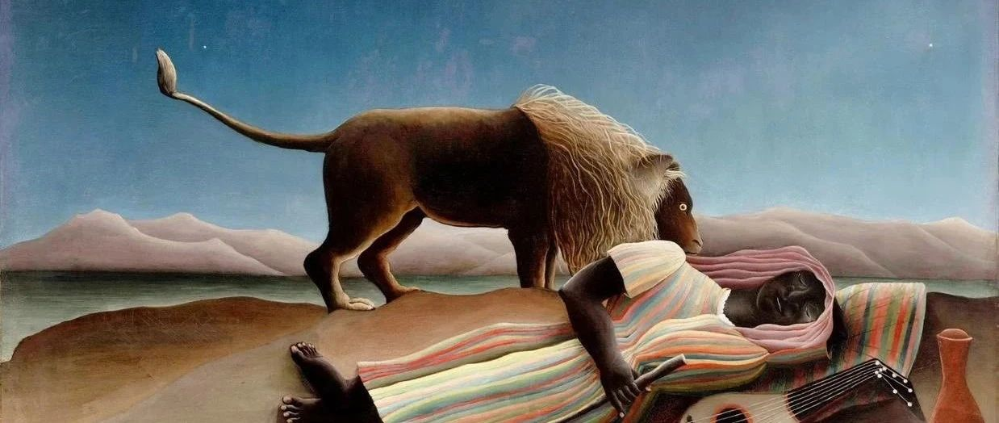
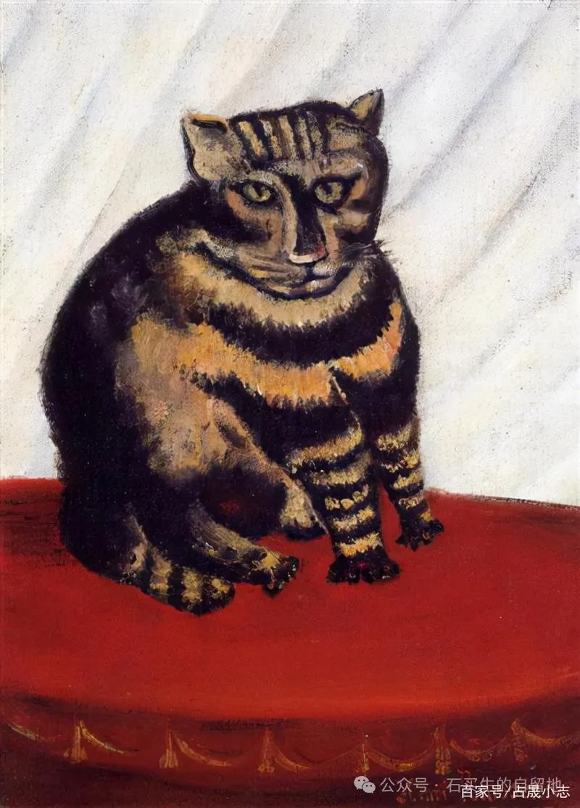
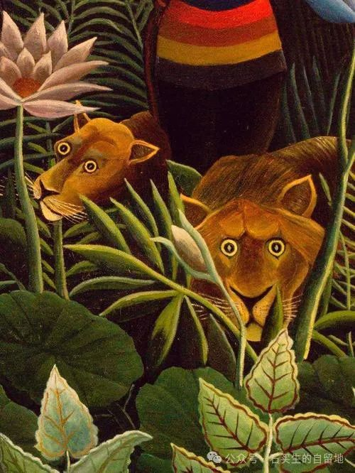
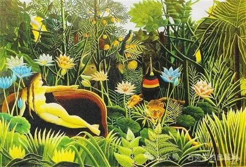

#  一条被虚构的鱼

原创  石买生  [ 石买生的自留地 ](javascript:void\(0\);)

__ _ _ _ _

卢梭名画

  

雨

踏着冬的节拍

粘着风斜逸

时断时续

像在给一个落魄者

平淡无奇的传记

写潦草的序

这个午后又飘进

博尔赫斯的庭院里

洗亮黑葡萄

已从青年写到暮年

圆润而冰冷

点点滴滴

  

细密飘忽朦胧

你在网里

像一条被虚构的鱼

  

卢梭名画

  

替身

妻子嘲笑的对象

变成了文学室一个白发苍苍的老者

他弓着背在《变形记》里出没

二者重叠

在那么多的眼睛里他成了他的替身

后者比前者更陌生更真实

格里高尔

幻化成了卡夫卡的影子在弥留之际

为母亲留下温情一瞥

尘世冷漠的灵魂

因仇恨而在暗夜游荡祝福来自异乡

爱的种子正长出新绿

冷峻忧郁的男子

哦是什么让你的仇父情结越来越深

虫身人面莫非同根同源

不变比变更荒诞

一静一动在时间的深渊里有序更替

他是最先消失的那部分

卢梭名画

留住

运动场亮如白昼

镁光灯是夜幕的唇

草坪上的足球

想留住少年的脚

有人在篮球场嘶吼

他留住日子的颜色吗

几棵桃花心木

留住了黛绿沉郁

夜色如此斑斓

都是假象

蓝色跑道上踱来

一个银发老者

她一边刷视屏

一边偷笑

像娇润的花蕊

留住了春天

她的柿子脸

让暮色鲜活而生动

  

注：图片来自网络

预览时标签不可点

微信扫一扫  
关注该公众号

****

****

×  分析

__

微信扫一扫可打开此内容，  
使用完整服务

：  ，  ，  ，  ，  ，  ，  ，  ，  ，  ，  ，  ，  。  视频  小程序  赞  ，轻点两下取消赞  在看  ，轻点两下取消在看
分享  留言  收藏  听过

精选留言

