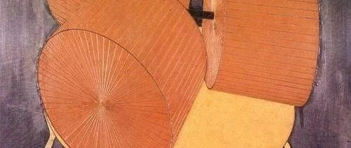
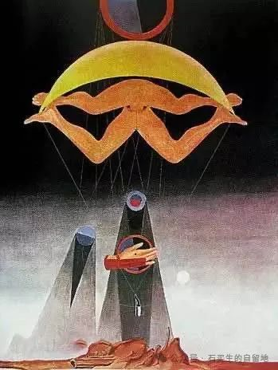
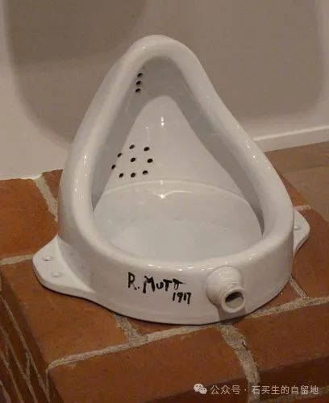
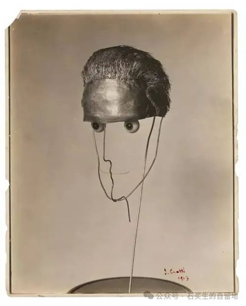
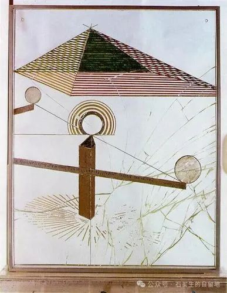

#  零八后眼里的世界

原创  石买生  [ 石买生的自留地 ](javascript:void\(0\);)

__ _ _ _ _

按语：我想通过一次命题作文的方式，了解零八后眼里世界的样子，以及他们心中世界和他们自己理想的样子。他们的观察、思考和警醒的文字令我惊讶不已。

杜尚名画

  

我的世界观

东莞中学松山湖学校2024级高一（15）班 周芷彤

世界观，这是个很大的词。其实我过去的的15年人生中，我从未思考过这个问题。我一直自然而然的生活，成长，从出生到现在，平淡，波澜不惊。直到老师提出这个题目时，我才开始思索，我认为的世界是什么样的？

我几经思考，最后总结出了两点，这倾尽了我的所有经历和阅历，或许之后再看会觉得很幼稚，但这已经是我所能接触到的全部世界了。

第1， 世界是美好的。我从小生活在中国，长在和平的年代，又赶上正在快速发展的时代，
也生在了一个美满的家庭。从小在我身边的人都是很好的人，从小经历的事情都是美好的事情。在我看来，世界是小时候的游乐园和冰淇凌，是炎热夏天的红豆冰，是老家门口开满野花的小道，是学校里可爱善良的同学。虽然我好像从来没有怎么意识到，但我其实很喜欢这个世界，话着让人开心，让人向往。或许世界上也有很多不美好的地方，比如不断爆发的战争，犯罪集团的聚集地，但那暂时属于我还无法接触到的世界，因此，我在此狭隘的认为世界是美好的。同是也真挚的希望所有的战争和罪恶都能停止，让世界真的充满好。人间太美了，有花就够了，不该染上血。

第二，人都是双面的，在我看来，好人与坏人并不那么经渭分明。这世界上有很多事情，不能仅看表面就做定夺，甚至有的时候，表相之下的那一层都未必是真相。这世上的很多人，都极难在激烈的情感面前保持一双清明的眼，一颗冷静的心，去想一想，去看一看那些遮盖在沙尘之下的真相。我想，或许人与人之间的许多矛盾与恶意，偏见与误解，都是这样产生的。因此，我们判断人也好，事也好，都须慎之又慎，在心里给每个人都留有转圜的余地，尽量不以最大恶意去揣测事情。当然，我也不觉得这个世界上存在完全意义上的好人，每个人的内心都会有阴暗的地方，只是为了维持社交和脸面，通常都会尽力隐藏而已，所以，不论什么时候，都不应完全信任某个人，相信世界人没有绝对的好人，也没有绝对的坏人。

这就是我的世界观。

杜尚名画

  

我的世界观

东莞中学松山湖学校2024级高一（15）班 刘子晖

  

生于这个世界，每个人都有不同的观念，对这个世界的一切都充满了好奇。于我，世界是充满未知的，一切事情都充满了可能。

在我观念中，世界的尽头是物理，物理的尽头是哲学，似乎一切事物都存在其出现的道理，但这个道理于每个人又是不同的。明代的王阳明就提出了王明心学，而众多伟人也是偏向唯心主义，所有的道理皆在心中，这即是我认同的观念。

人生来即是奋斗的，而不是堕落的。许多人都希望能够躺平，可在这躺平的过程中，又有种莫名的空虚，人的天性是懒惰的，可真正获得了躺平，心中多少有些不自在。世界上许多富翁，如比尔盖茨，马斯克，中国的马云，他们在获得了财富和自由后，仍然选择了努力奋斗，并做到了富贵不能淫，贫贱不能移。

世间几乎不存在真正意义上的爱情，多项科学研究表明，人在爱一个人时会释放一种激素，可这种激素至多存在四年至五年，不会说一生一世的长久、所以婚礼上一切爱你一生一世，只不过是一个美丽的谎言罢了，爱情是很难长久的。

这个世界自由是相对的，没有绝对的自由。一切的自由都有其边界即规则。古人云：“没有规矩，不成方圆。”当代社会是法治社会，一切行为都要符法律准则。
荀子云：“人性本恶。”而我们就还要通过这些条条框框来不断约束自己，从而使自己的品质道德等方面得到提升，使自身从恶到善，再到圣人的境界。

世界之大，无奇不有。爱情，本性，人生奋斗都是影响这个世界的重要因素。而于我，爱情，本性，人生奋斗皆是影响我这一生的重要因素。

世界之未知终将成就我之伟大，世界之可能终将成就我之未来，世界之自由终将为我提供更大的舞台，我将以更加崭新的世界观和全新的姿态去拥抱，感受，亲近这个世界。

杜尚名画

  

我的世界观

东莞中学松山湖学校2024级高一（15）班 陈钰荣

  

在浩瀚的宇宙中，每一颗星辰都闪烁着独特的光芒，正如每个人心中那份对世界独有的理解，我们生而为人，不仅是在探索外界的奥秘，更是在内心深处构建着属于自己的世界观。

在这个五彩斑斓的世界里，每一处风景，每一段历史，每一种文化都如同万花筒般绚烂多彩，从小我就被这种多样性深深吸引，从书本上了解到世界各地的风土人情，从纪录片中目睹自然界的壮丽奇观，这些都激发了我对未知世界的好奇心。正如哥伦布勇敢地驶向未知的大海，我也渴望在知识的海洋中航行，去探寻那些未被发现的宝藏。

每个人的成长轨迹都是独一无二的，我的价值观也在这一过程中逐渐形成，从童年的纯真无邪，到青春期的叛逆探索，再到成年后的责任担当，每一次选择，每一次成功，都如同雕刻刀一般，在一次志愿服务中，我深刻体会到了帮助他人的快乐，这让我意识到，真正的价值不仅仅在于个人的成就，更在于能为社会带来多少正能量。这种价值观的形成，让我更加坚定地走上了奉献与爱的道路。

世界在变，我也在变。而对日新月异的社会，我深知自己的世界观不可能一成不变，因此，我始终保持着一颗谦逊的心，不断学习新知识，接受新观念，对过去的认知进行持续的反思与修正。就像牛顿在晚年对自己的科学成就进行深刻反思。这种持续的反思，让我更加理性地看待世界，更加客观地评价自己，也让我在人生的道路上少走了许多弯路。

在探索与反思的征途中，我的世界观如同一幅不断绘制的画卷，既有色彩斑斓的风景，也有曲折婉蜒的小径。我深知，这幅画卷远远未完成，未来的路还很长。但我相信，只要保持对世界的好奇，对价值的坚守，对自我的反思，我就能在这幅画卷上留下更加精彩的一笔。我的世界观，正是在这样的过程中，不断构筑、不断完善，最终成为我人生道路上最坚实的灯塔，让我能随着灯塔稳步前行。

杜尚名画

  

我的世界观

东莞中学松山湖学校2024级 高一（15）班  谢秀文

作为一名高中生，我常常思索自己眼中的世界究竟是什么模样。在这成长的关键阶段，知识如潮水般涌来，每一次学习、每一次经历，都像是在为我勾勒世界观的轮廓。

在学习的漫漫长路上，我渐渐明白，努力是通往梦想的唯一捷径。课堂上的难题、考试的压力，这些都曾让我苦恼，但我从未想过放弃。我知道，每一次解开数学难题，背下一篇文言文，都是在给自己的未来积攒能量。就像跑马拉松，途中虽气喘吁吁、脚步沉重，但只要坚持向前，总能离终点更近一步。我不相信有不劳而获的成功，那些挑灯夜读的日子，终将化作照亮前路的光，让我有足够的底气去拥抱未来的无限可能。

身处校园与家庭，人际关系也是我世界观的重要拼图。和同学相处，有欢笑也有摩擦。有时为了一场比赛的战术各执一词，有时又因解开一道难题而欢呼雀跃。我开始懂得，理解与包容是友谊的黏合剂。在家里，面对父母偶尔的唠叨，我不再抵触，而是换位思考，明白那背后是深沉的爱。在这个小小的社交圈里，我学着去付出真心，收获温暖，也懂得了尊重不同性格、不同想法的人，因为正是这些差异，让生活变得丰富多彩。

望向更广阔的社会天地，科技的飞速发展让我惊叹不已。从便捷的移动支付到能探索宇宙的航天成就，我看到人类智慧的磅礴伟力。同时，社会问题也不容忽视，环境污染、资源短缺，像警钟在我耳边敲响。我意识到，自己作为未来社会的建设者，不能只做旁观者。或许现在力量微薄，但从点滴小事做起，节约用水、倡导环保，未来就能汇聚成改变世界的洪流。我希望用知识武装自己，有朝一日能投身到解决这些难题的大军中，为社会进步添一份力。

对于这个浩瀚宇宙，我满怀敬畏。地理课上了解地球在宇宙中的渺小，物理课探究天体运行规律，都让我心潮澎湃。宇宙如此之大，未知如此之多，这让我愈发渴望知识，想去揭开那些神秘面纱。每当仰望星空，我都深知人类命运相连，保护地球家园是共同责任。

在这高中岁月，我一点点拼凑世界观的碎片。虽尚不完整，但它指引着我前行。我愿带着这份对世界的认知，在成长路上披荆斩棘，书写属于自己的精彩人生，努力让这个世界因我而有一点点不同。

  

注：图片来自网络

预览时标签不可点

微信扫一扫  
关注该公众号

****

****

×  分析

__

微信扫一扫可打开此内容，  
使用完整服务

：  ，  ，  ，  ，  ，  ，  ，  ，  ，  ，  ，  ，  。  视频  小程序  赞  ，轻点两下取消赞  在看  ，轻点两下取消在看
分享  留言  收藏  听过

精选留言

