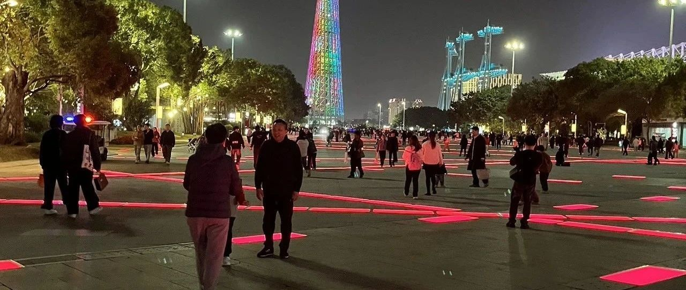
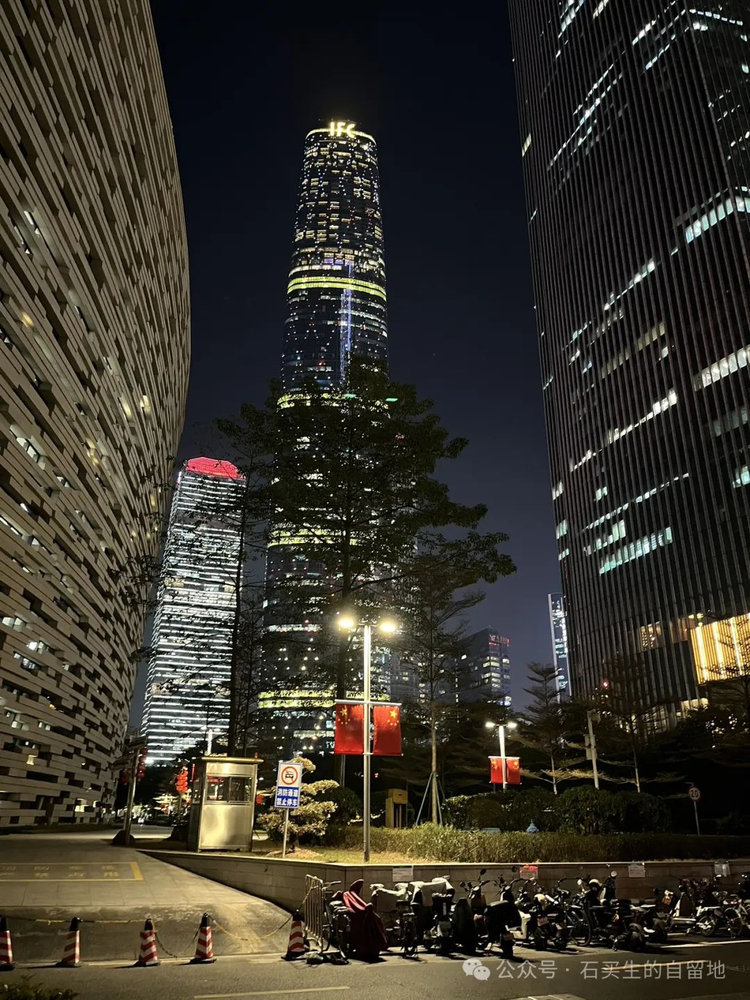
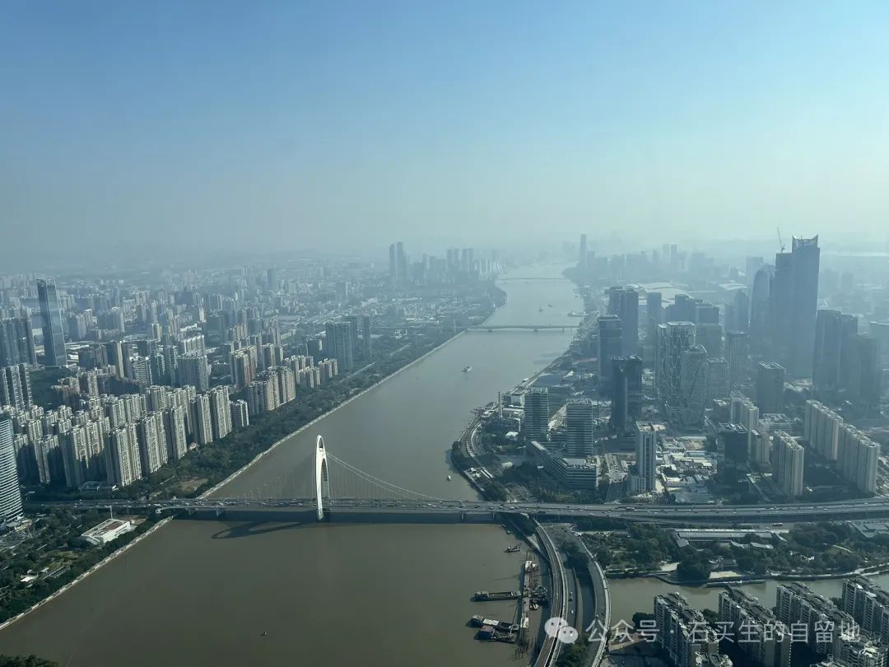

#  不止五个人的日出

原创  石买生  [ 石买生的自留地 ](javascript:void\(0\);)

__ _ _ _ _

莫奈名画

  

不止五个人的日出

  

2024年12月29日的日头

注定为五个人喷涌而出

  

它一半脸藏在在运动场树梢上

比平日大、圆

  

它深沉的桔黄

把地平线抛出老远

  

三个小伙子在投篮

一个银发飘飘的老者在疾走

  

一个姑娘坐在旗杆旁台阶上

双手托着下颌凝望东方

  

她旁边白色帆布袋

有书本在晨曦里散发暗香

  

它的盛大辉煌

也注定不让五个人晕眩

  

此时世上还处在饥寒中的人

它的爱缓慢而温软

  

面对遥远的夏天

那越来越多受伤的心灵

  

它的炙热和浓烈

将一如既往

  

自拍照片

  

完全主观美学

  

  

我们四个人

在松湖烟雨穿越斑马线

好几辆车呼啸而过

  

终于一辆红色轿车慢下来

停住了

等我们慢慢通过

  

我们的脚像踩在冬日白云上

满眼里

开满春天的花朵

  

刚才车里的阿姨真漂亮

乐乐一过马路

就称赞她长得像英文

  

妻子笑旺仔一个劲儿憨

我在想前面飞过的黑色轿车

里边大叔的长相

  

自拍照片

  

广州塔

  

我坐电梯

登上圆形星空观光大厅

我看见许多人

俯瞰拍照

想把墨绿的珠江

朦胧的白云山

清丽的越秀

中山公园

一一占为己有

我也和他们一样

假装情绪激昂转圈拍照

然后意兴阑珊

下到地面留下塔影

然后藏身人海

将广州彻底肢解遗忘

作为一个旅人

我又一次

成功抵达宿命

  

  

注：图片来自网络和自拍

预览时标签不可点

微信扫一扫  
关注该公众号

****

****

×  分析

__

微信扫一扫可打开此内容，  
使用完整服务

：  ，  ，  ，  ，  ，  ，  ，  ，  ，  ，  ，  ，  。  视频  小程序  赞  ，轻点两下取消赞  在看  ，轻点两下取消在看
分享  留言  收藏  听过

精选留言

鱼来自广东

有一种纪实又虚幻的美感

冠辉～ray来自广东

广州那边永庆坊、荔枝湾还不错，老师[偷笑]

