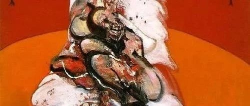
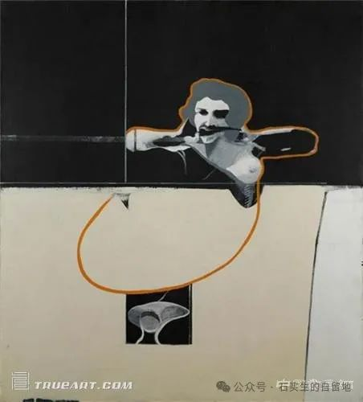
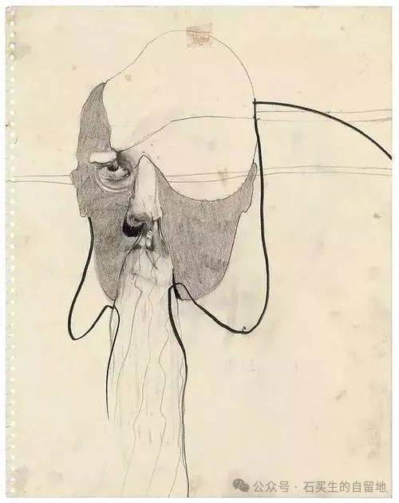
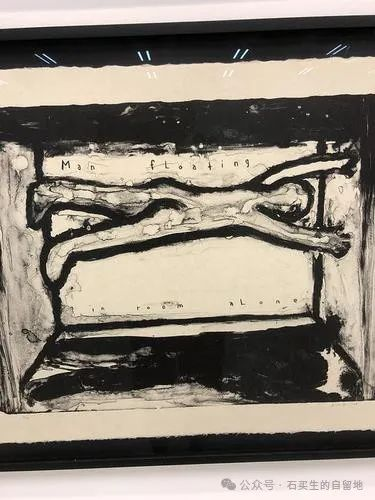
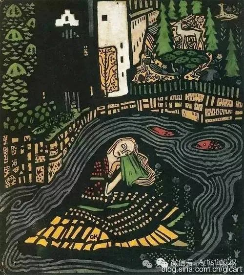

#  流年与空白

原创  石买生  [ 石买生的自留地 ](javascript:void\(0\);)

__ _ _ _ _

大卫• 林奇名画

  

流年与空白

  

2025年元月13日下午四点

我打开新浪邮箱

看见右上角标示：

最近联系人，括号100

所有联系人，括号734

朋友，括号1

写给自己的信，空白

括号也没

  

这么多年在世上流连

发出了那么多信

只找到一个

不是知音的知音

多么混账的东西啊

从没叫一声自己

亲爱的

大卫林奇名画

  

又一个梦

  

临近年关

老家寒风凛冽

音信全无

  

午夜

老母搀着老父

朝我走来

一个脸色苍白

一个表情落寞

  

我从一处校门踅出

迎上前

不知所往

不知所终

  

大卫林奇名画

  

天造地设

  

黄昏或黎明

一个矮小男子和一个富态女子

在运动场散步

霞光和晨曦

让他们脸上的中老年斑

更加显眼

  

他们的步子呈剪形

身后不断飘落

片片云彩碎碎天光

他们交谈时

暗流涌动，似乎

嫌弃多于爱

  

爱

远在天边

儿女让每一天泛起涟漪

  

嫌弃

一个假装爱自己男人

胜过爱钱

一个眼神游弋

老瞟不该瞟的人

  

上帝把这一切看得清清

笑而不语

三十三年前早就安排好了

良女配恶棍

天造地设

大卫林奇名画

  

句子控

  

我常为一些句子痴迷，

心被挠得痒痒。

  

肖斯塔科维奇倾诉

请在我们脏时爱我们。

  

心，是用来碎的

王尔德调侃。

  

梭罗在湖畔低语

我们正在过静静的绝望的生活。

  

世上有两样东西最脏，

我独爱其一。

  

那隐秘的快乐，

我不告诉你。

  

  

注：图片来自网络

预览时标签不可点

修改于

微信扫一扫  
关注该公众号

****

****

×  分析

__

微信扫一扫可打开此内容，  
使用完整服务

：  ，  ，  ，  ，  ，  ，  ，  ，  ，  ，  ，  ，  。  视频  小程序  赞  ，轻点两下取消赞  在看  ，轻点两下取消在看
分享  留言  收藏  听过

精选留言

