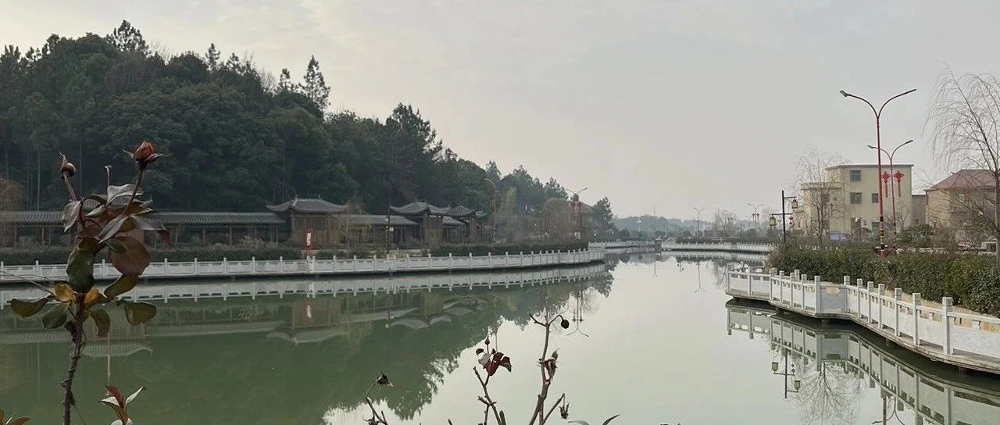
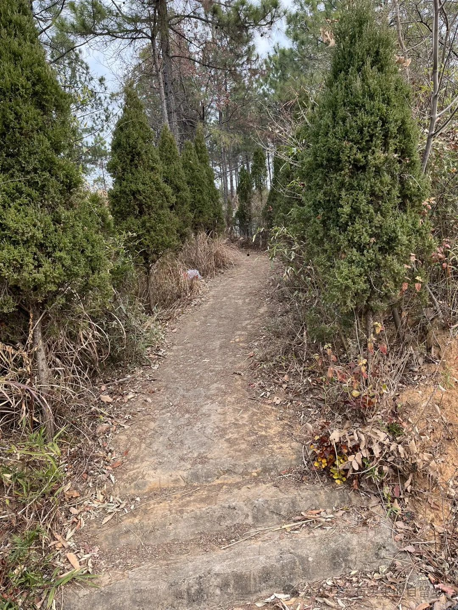
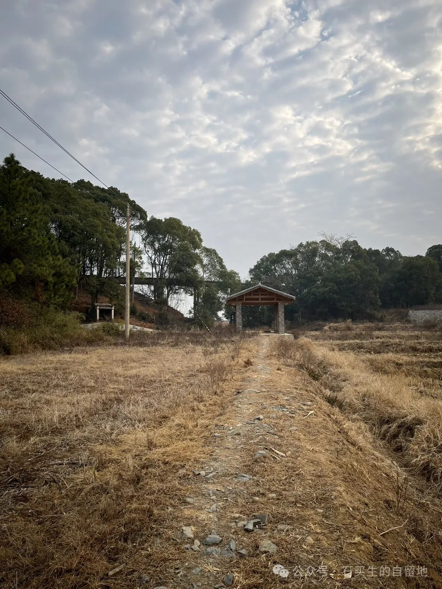
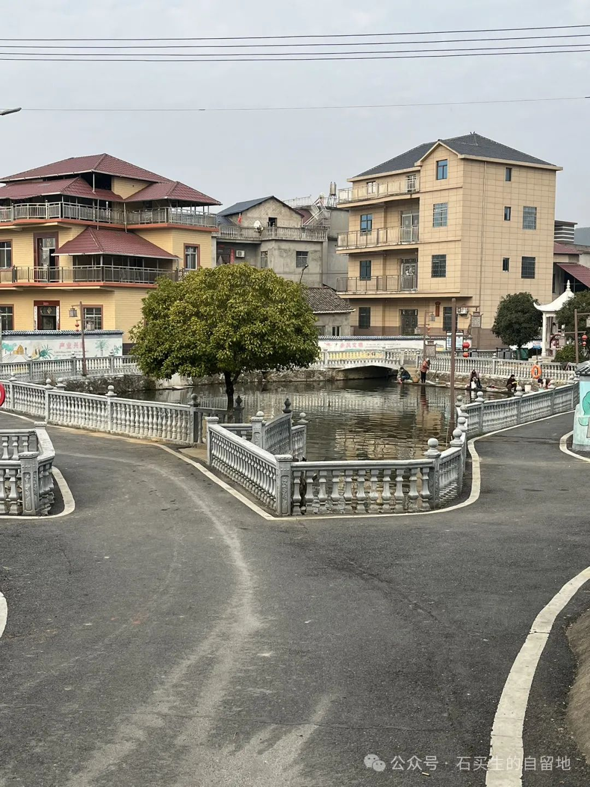

#  终于难倒AI，deepseek的同题诗

原创  石买生  [ 石买生的自留地 ](javascript:void\(0\);)

__ _ _ _ _

在老家过年

自拍照片

  

看望父母的路

  

有一段是尘土沙石

有一段杂草荆棘

两边翠柏

吸纳天边流云

中间裸露一片褐色

把空旷

留给生命已至的迟暮

枯枝的微甘

追不回青春已逝的荒凉

  

野麦岭东边

自留地一行茶丛的墨绿

仍在怀念我娘指尖的温柔

迟滞龟裂的土块

正渴念

我老父担粪来浇灌

  

一对老馆早已了却尘凡

在野麦岭静静安眠

他们坟前的青藤

缀满了对子孙深深祝福

  

过年爆竹声声

我总往那条路凝望

村东的邹公塘啊

清波里全是我的忧伤

  

  

看望父母的路  
  
石阶在杂草中练习倒立  
三十年前车辙的沟壑里  
苔藓正缝合褪色的辙痕  
路槽里积满去年的雨水  
每颗水珠都裹着  
半枚锈蚀的月亮  
  
松针把黄昏扎成漏风的竹筛  
枯叶在碑前转圈时  
总模仿母亲纳鞋底的手势  
我数着腐殖层下拱动的树根  
它们用暗语交换着  
泥土深处的年轮密码  
  
山雾突然垂下半透明的绳梯  
雨滴悬停在离地三尺处  
像你临终前未拆封的糖纸  
此时所有被苔藓吞没的足印  
突然翻过身来  
喊出我乳名的偏旁

  

猜猜看，哪首是ai所做？

  

自拍照片

  

赣北古亭

  

青苔在石阶背面刻族谱  
三百年车辙已长成皱纹  
路槽里积满去年的天空  
云絮浸泡成褪色药渣时  
总有人弯腰捡拾车铃铛  
锈蚀的碎片  
  
樟树把暗香摁进黄昏褶皱  
某片叶子坠落自带碾米声  
纸钱的灰烬在半空练习回旋  
像童年丢失的陀螺  
仍在寻找那根磨损的鞭绳  
  
风翻动碑文里冬眠的蝉蜕  
瓦当下垂着半滴未落的雨  
石柱体温比族谱更潮湿  
当最后一道车辙被苔藓缝合  
所有未寄出的信  
都长出根须

  

  

赣北古亭

  

一条路槽像一条深褐色围巾

挂在樟树丛中

天边的乌云地上的荒草

等不来一个人影

只有冷风伴着时间流逝

古亭修葺一新

像古籍里那个著名典故

在无涯的荒野里

借尸还魂

  

猜猜看，哪首是ai所作？

  

写一首诗：题目《上塘居士》，突出环境变化，和人物因时间变化而变化

  

服务器繁忙，请稍后再试。

  

自拍照片

  

上塘居士

  

童年的发小

变成了暮年的小老头

一个胡子红了

一个须发白了

鱼网上那条大花鲢

哪去了

  

乌桕树哪去了

香樟哪去了

一茬一茬长辈们

哪去了

上塘洲旧貌换新颜

霓虹夜夜闪烁

让村庄迷离

  

塘上的人

应时奔赴他乡

一辈子葆有纯真质朴

由赤子变游子

再变游子为居士

  

  

服务器繁忙，请稍后再试。

  

这首同题诗，ai试了三次，都没有写出来，看来大数据没有相关信息，人类的人原创也有难倒deepseek的时候啊。

预览时标签不可点

微信扫一扫  
关注该公众号

****

****

×  分析

__

微信扫一扫可打开此内容，  
使用完整服务

：  ，  ，  ，  ，  ，  ，  ，  ，  ，  ，  ，  ，  。  视频  小程序  赞  ，轻点两下取消赞  在看  ，轻点两下取消在看
分享  留言  收藏  听过

精选留言

unicorn来自广东

[强][强][强]

石买生的自留地来自

[握手][玫瑰]

山截来自广东

真人写的诗里面我感觉有记忆的风味，而ai写诗的话更像在一块素布上织蕾丝

石买生的自留地来自

比喻生动形象，很在理啊

白白来自广东

[强][强][强]ai其实是用同义替换、多句打散重组，把名家作品中的意象杂糅到一起显得只是词藻的堆砌了

石买生的自留地来自

精辟[强][玫瑰]

ZZF来自广东

AI毕竟是AI，哪里有诗人的独特感受

石买生的自留地来自

的确如此

石来自广东

当人类赋予Ai思考能力的时候，那真的可怕。

老 安来自上海

老买的诗，宣告着AI时代的到来

石买生的自留地来自

[握手][咖啡]

NaAlO₂来自广东

老师好厉害

Forrest来自河南

字数多的是AI写的

石买生的自留地来自

[强][玫瑰]

妳.来自广东

我猜Ai所作的第一篇是第二份，第二篇是第一份，对吗[破涕为笑]

石买生的自留地来自

[强]

妳.来自广东

服务器繁忙的问题我也遇到过，是这样的，每次对话发第三句时就服务器繁忙，大概是用户太多了，有时候重新进入，进行新的对话，就可以把刚刚的信息发给他了

石买生的自留地来自

[握手][玫瑰]

