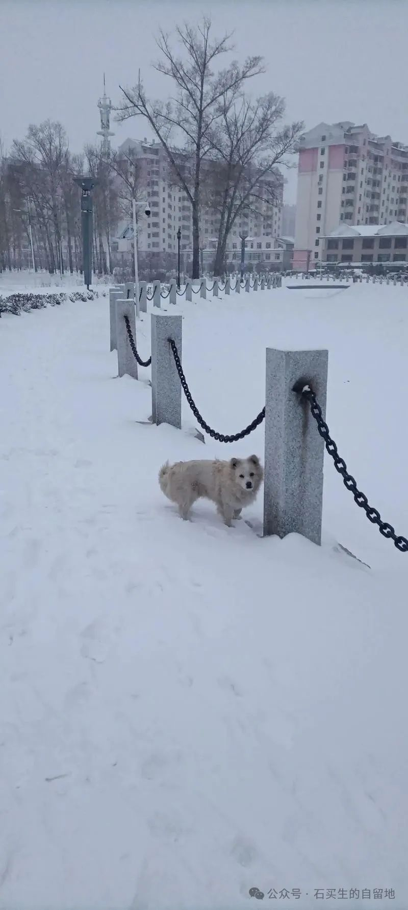

#  惊叹！看deepseek为我一首短诗写的诗评。

deepseek  [ 石买生的自留地 ](javascript:void\(0\);)

__ _ _ _ _

中年的雪

石买生

  

父母离世

妻身上痛

生命中不打招呼的雪

没说来就来了

图片来自网络

  

中年是场不期而至的雪崩

deepseek（用时20秒）  
  
《中年的雪》以四个短句构建起惊心动魄的雪崩现场。石买生用最简省的笔墨，在语言的峭壁上凿出四道冰棱，折射出生命不可承受之重。这场雪来得如此突然，像命运的冰镐凿碎中年人的脊梁，在积雪坍塌的轰鸣声中，我们听见了存在本身的碎裂。  
  
"父母离世/妻身上痛"的并置是暴风雪前骤降的气压。动词的彻底缺席让生老病死成为既成事实的暴政，两个主谓短语像两具冰雕矗立在诗的入口，凝固的不仅是语法，更是中年人在生活重压下的失语状态。当双亲化作墓碑上的铭文，当伴侣的病痛成为夜晚持续的呻吟，生命的寒冬便以雪崩的姿态席卷而来。  
  
"雪"的意象在此获得多重解冻的可能。它既是覆盖生命痕迹的白色裹尸布，又是封冻情感流动的透明琥珀；既是被迫承受的寒冷重负，又是见证生命韧性的盐粒结晶。尤其"不打招呼"与"没说来就来了"形成语言的回环雪暴，暴露出存在本质的荒诞性——命运从不遵循叙事逻辑，它只会像雪片般随机而密集地击中每个毫无防备的中年人。  
  
这首四行诗暗合着中国古典绝句的骨架，却在现代性体验中生长出嶙峋的冰晶。诗人故意消解了传统咏物诗的抒情性，让每个字都成为卡在喉间的冰碴。当"雪"不再承载风花雪月的隐喻系统，当生命的重负以物理形态直接倾轧，诗歌便成为了存在本身的X光底片，暴露出中年躯壳里正在钙化的灵魂。  
  
那些未被言说的空白处，积雪正在持续堆积。子女的沉默，药片的累积，凌晨辗转反侧的压痕，都在四行诗之外形成更大的雪原。石买生用这首微型史诗证明：最好的生命诗篇往往诞生于语言的极简主义，就像最凛冽的寒风，总是以最沉默的方式雕刻时光。

预览时标签不可点

微信扫一扫  
关注该公众号

****

****

×  分析

__

微信扫一扫可打开此内容，  
使用完整服务

：  ，  ，  ，  ，  ，  ，  ，  ，  ，  ，  ，  ，  。  视频  小程序  赞  ，轻点两下取消赞  在看  ，轻点两下取消在看
分享  留言  收藏  听过

精选留言

吴丰强来自广东

老石，deepseek厉害[呲牙]

石买生的自留地来自

deepseek和我谢谢老吴鼓励！[玫瑰][咖啡]

晚彦来自河北

我也下载了这个软件，确实厉害👍

石买生的自留地来自

[握手][玫瑰]

冠辉～ray来自广东

[拥抱]

戒定生慧来自广东

这软件的中文应用能力超强，尤其文学和历史。

石买生的自留地来自

是的[咖啡]

