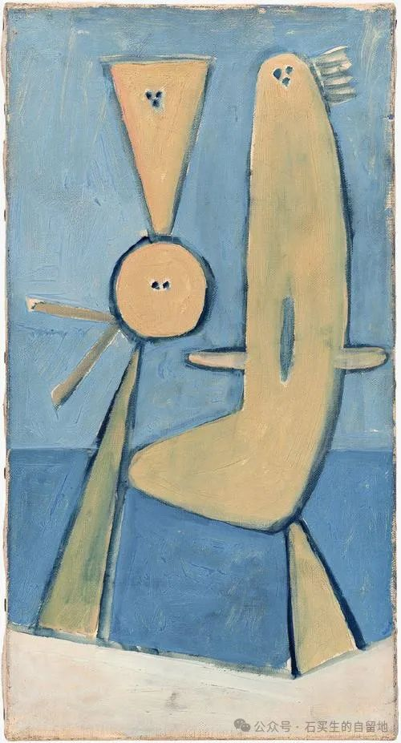

#  与AI竞赛系列之二：写诗评

原创  石买生  [ 石买生的自留地 ](javascript:void\(0\);)

__ _ _ _ _

遭遇

（美）拉塞尔·埃德森

一只手攥成昏然欲睡的拳头搁放在我面前的桌子上。

它突然转动它的背部，张开它的指头，仿佛在寻求它的手掌被人阅读。

然而，当我凝视它的线条，它却突然飞起来掴打我的脸。

我开始痛哭……

于是这同一只手开始拭去我的泪水……

一，手之谜

\---评拉塞尔·埃德森《遭遇》

我们来猜读这首有意思的诗。

  

1  ，手之疑

这是谁的手？陌生的手？熟悉的手？别人的手？自己的手？情人的手？上帝的手？这只手肉感丰满吗？这只手骨瘦如柴吗？这只手滑嫩细腻吗？这只手饱经沧桑吗？这只手为啥要握紧拳头？它到底意欲何为？它的样子为啥昏然欲睡？因为沮丧？因为疲倦？因为对自己的不满？因为对前途的迷惘？因为对这社会的仇恨？他为啥停住在桌子上？它停住的姿势怎样？
90  度直立？  45  度斜伸？  180  度平躺？它的心理怎样？静如止水？狂躁？暴风雨前的宁静？

  

2  ，手之梦

  

沉默肯定不是它此生的追求。在沉静的时光中，它所有的佯装可能都是为了更大的爆发。它貌似沉睡的外表下，隐藏着一颗怎样焦灼的心？生活中有许多未解之谜，其中谜底之一就是学会等待。然后做梦，梦醒时分，它突然毒蛇一样转动背部，它的冷血在喷涌，它的五指在舒展，此时，它多么渴望被安抚、被爱恋。原来，那么多卑微的命运并没有被规定，是时候啦，一辈子被忽视、被冷落的命运应该被终止，它在寻找一双眼睛，一张脸，一颗柔软的心。

  

3  ，手与我

  

怎么啦，难道是我的好奇激怒了它的脆落的神经？难道我把它当成小丑看？难道我的眼神猥琐、乖张、不屑、调侃深深戳痛了它？难道它忍受不了我的德行和鬼样子？它啪地
\---
飞起给我一巴掌，呵呵，它的快乐就是将它的仇恨释放，然后看我脸上的红指印，还有我屈辱的泪水。它认为这是对背叛者最好的惩罚。它惩罚了我还要我对它感恩，因为不久它又假惺惺地帮我拭去泪水。我真是背叛者吗？我真这么贱吗？我的被打是罪有应得的吗？

  

4  ，手之遭遇

  

这只神秘的手，因命运被忽略，因麻木成习惯，因屈辱深入骨髓，某一天，突然爆发了，打了一张最应该被打的脸，于是，幽暗的生命被照亮了；于是，世界有了些微的改变；于是，有手、有人在泪水里得以重生。

毕加索名画

  

二，一只手的荒诞与人性切片

\----评拉塞尔·埃德森《遭遇》  
  
拉塞尔·埃德森的短诗《遭遇》像一幕微型荒诞剧，用短短五行勾勒出人与“手”之间既暴力又温柔的互动。诗中那只失控的手，既是身体的延伸，又是独立的生命体，它的动作从“昏然欲睡”到“掴打”，再到“拭泪”，像一场关于矛盾情感的寓言。全诗没有复杂的意象堆砌，却以极简的叙事张力刺破了日常生活的表皮，暴露出人性中荒诞又真实的褶皱。  
  
#### 一、**荒诞中的真实：身体的背叛与和解**  
诗中的“手”被赋予了自主意识。它先是“攥成昏然欲睡的拳头”，像一个慵懒的旁观者；接着突然“张开指头”试图被阅读，仿佛在渴求理解；但随即又失控地“掴打”主人，引发痛哭；最终，这只手又以抚慰者的姿态拭去泪水。这种矛盾的举动，既像身体对意识的背叛，又像人格分裂的具象化。埃德森擅长用日常物件的异化揭示人性暗流，比如在《奶酪》中，捕鼠夹夹住断手的情节同样以荒诞指向存在的脆弱。  
  
手的双重性让人联想到人际关系的复杂性：伤害与治愈、疏离与依赖往往由同一主体完成。这种“自虐式温柔”或许隐喻了人如何处理自我冲突——暴力与共情如同硬币的两面，共存于同一具躯体中。  
  
#### 二、**被物化的情感：手掌阅读的失效**  
诗中“寻求手掌被人阅读”的细节耐人寻味。手相学中，掌纹是命运的密码，但在这里，“凝视线条”不仅未能带来理解，反而触发暴力。埃德森似乎在讽刺人类对符号的迷信：我们总试图通过表象（如语言、动作）解读他人，却常因误读引发冲突。这种“沟通的荒诞性”在他的其他作品中也有体现，比如《狗尾巴》中老太太用狗尾搅拌罐子的无意义行为，或是《圣母》里长胡子的圣母与老头的尴尬对话。  
  
手的攻击性可能暗示语言与行为的割裂：当人试图用理性（凝视）掌控情感（手掌）时，反而激起了非理性的反抗。正如埃德森在散文诗理论中提到的，“散文诗的内容创造自己的形式”，这首诗的形式本身就像一次失控的“反逻辑实验”。  
  
#### 三、**循环的暴力：痛苦与抚慰的同源性**  
诗末的转折——“同一只手开始拭去我的泪水”——是典型的埃德森式黑色幽默。施暴者与救赎者的身份重叠，让人联想到家庭暴力中的矛盾情感，或自我惩罚后的自怜。这种“痛并治愈”的循环，揭示了人类情感机制的吊诡：伤害与关怀往往同源而生，甚至互为条件。  
  
在埃德森笔下，荒诞常是现实的变形镜。例如《掏空的猪》中，屠夫为做猪衣服掏空猪体，却陷入如何处理内脏的无限循环，隐喻现代人解决一个问题却制造更多问题的困境。而《遭遇》中手的矛盾行为，或许正是对现代人精神分裂状态的隐喻：我们既渴望被理解，又恐惧被看透；既制造痛苦，又依赖痛苦维系存在感。  
  
#### 四、**极简叙事的后现代性**  
全诗仅五句，却包含起承转合的完整叙事。埃德森摒弃传统诗歌的抒情与意象堆砌，转而用散文诗的松散节奏和小说化的场景切片，构建出微型戏剧冲突。这种“反诗歌”风格与他“寓言体散文诗”的创作理念一致：通过日常场景的扭曲，让读者在错位中触摸真实。  
  
与同时代诗人不同，埃德森的诗不追求哲理的宏大，而是聚焦于荒诞细节的爆破力。正如莉迪亚·戴维斯评价的，他的作品“似乎在告诉你，可以尝试任何新鲜事物，也许不会成功，但是没关系”。这首诗的结尾未给出答案，却让读者在手的暴力与温柔中，咀嚼出存在的苦涩与幽默。  
  
### 结语：一场与自己的遭遇  
《遭遇》或许是一场自我与身体、理性与情感的遭遇战。那只手既是“他者”，也是被异化的“自我”。当我们在生活中被情绪掴打时，或许也会发现，唯一能拭去泪水的，正是制造伤痕的那双手。埃德森的诗像一把钝刀，剖开现代生活的麻木，让我们在荒诞的刺痛中，重新感知血肉的温度。

  

毕加索名画

  

读者诸君，猜猜看，哪篇是AI所作，哪篇是我所作？欢迎点评。

预览时标签不可点

微信扫一扫  
关注该公众号

****

****

×  分析

__

微信扫一扫可打开此内容，  
使用完整服务

：  ，  ，  ，  ，  ，  ，  ，  ，  ，  ，  ，  ，  。  视频  小程序  赞  ，轻点两下取消赞  在看  ，轻点两下取消在看
分享  留言  收藏  听过

精选留言

