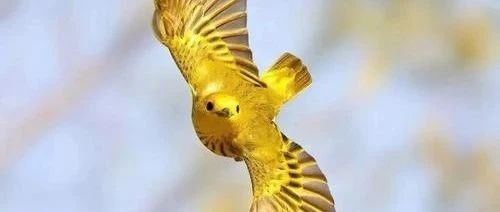
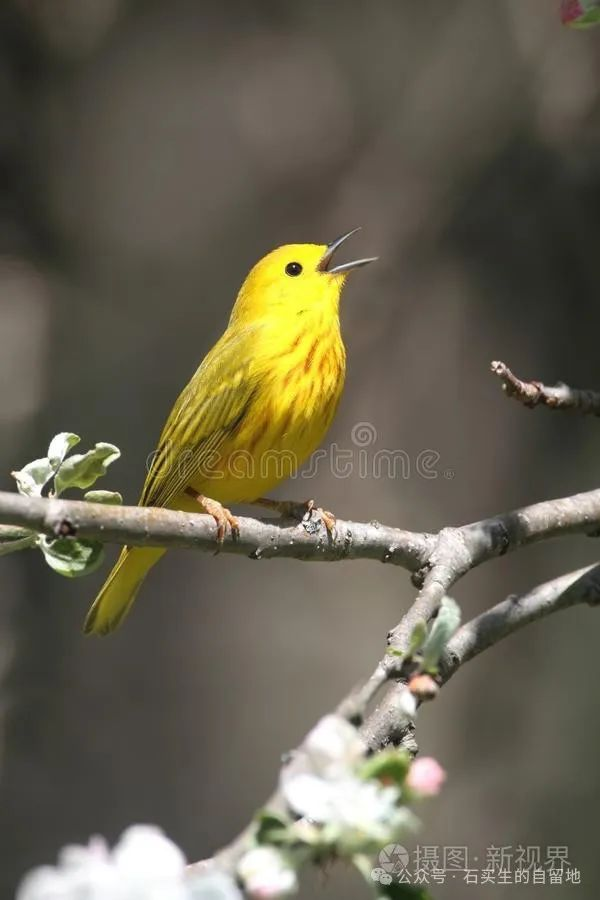

#  自在娇莺恰恰啼

原创  石买生  [ 石买生的自留地 ](javascript:void\(0\);)

__ _ _ _ _

图片来自网络

  

自在娇莺恰恰啼

\---序《松湖元音诗选》

在美丽的松山湖畔，有这么一座花园式学校------
东莞中学松山湖学校。校园里，天空碧澄，空气清新，绿树红楼，翠草如茵，琅琅书声常在蓝天白云间回荡。许多园丁在这园地里披日光，伴星斗，辛勤劳作，精心培育，百般呵护。幼苗转眼三五载，满园春色竟葱茏。花园里可见四季各色鲜花盛开：白玉兰、紫荆、风铃木、芙蓉、凤凰花、紫薇、桂花，争相吐艳，于是引来众鸟齐鸣，百转千啼，如杜甫诗云：“流连戏蝶时时舞，自在娇莺恰恰啼”。此等天籁清音，若缕缕清泉，流入万千学子纯洁心田。缪斯女神也不闲着，适时潜入园中，琴弦拨动，灵感迸发，情思翩翩，瑰丽动人的诗篇渐次跃入眼帘------

第一缕情丝来自重返天空的雪：

雪

邓雅怡

今夜，雪地里没有花朵

我便是唯一的寂寞的花朵

我什么也没有得到

我什么也没有失去

因为我是雪

是雪地里唯一寂寞的雪

雪从天上落下来

而我是即将重返天空的雪

这个希望20岁死在冰岛雪地里的女孩，多么好地诠释了什么叫想象的神奇，什么叫浪漫与唯美。原来，雪不光属于童年，属于纯洁，属于北国，属于天空；同样，雪也属于青春，属于迷茫，属于南国，属于白日梦。雪在天上写满了故事，雪在地上也留下了诗篇，雪在这里成了真正的精灵，雪让一个女孩晶莹剔透、美轮美奂。

第二缕情思来自现实的倒影：

理想生活

王明宇

想过中年生活

一些欢愉

熬好了的粥

墙上的梵高

浣完花

妻子不再说谎我爱她

此时此刻这种人间烟火

对得起每次日落

一个青涩少年，竟想过中年生活。小小年纪，至深渴望。我惊讶于他在此诗流露的沧桑感。但是，一些小欢愉、淡白的粥、有艺术品味的梵高、对爱情与家庭的忠诚、人间烟火味儿，不正是我们每个小民梦寐以求的素朴生活吗？这种质朴的、接地气的生活，我们啥时候弄丢了呢？这首诗好似一面镜子，它照见了家庭生活的缝隙和空白，让任何一个成年人沉思良久，两眼泛白。

第三缕情思来自一条庸常的拉链：

同理心

易欣怡

拉链以为

世界上所有的伤口

都会愈合

古有咏物诗，日本有俳句，今还有截句。其共同点是诗句高度简洁、凝练，含有深刻的哲理性。此诗以拉链作为描写对象，将拉链比作伤口，新颖别致，既有哲思，又扣人心弦，余味隽永。作为一个俗世之人，此时还有一个微妙的提醒：这世上有一些有伤口的心灵，常常被忽视，被践踏，甚至被剜去一小块，它们常常在暗夜哭泣……

当然，这样子动人的情思，还有的来自对素年锦时的痴迷与眷恋，还有的来自对寸草春晖的体悟与回馈，还有的来自对爱神的缱绻与真情，还有的来自于对旅途的且行且吟，还有的来自于对杏坛的守望与歌吟。松湖校园钟灵毓秀，很庆幸，这里有一批亲吻过缪斯也被缪斯亲吻过的人，他们就好像杜甫笔下的娇莺，自由鸣啼，百转千回，声音清越嘹亮，响遏流云。这种歌吟不仅使我们平淡的生活有了色彩，也使我们对未来美好生活的向往有了可能。

是为序。

  

图片来自网络

  

  

  

注：图片来自网络

预览时标签不可点

微信扫一扫  
关注该公众号

****

****

×  分析

__

微信扫一扫可打开此内容，  
使用完整服务

：  ，  ，  ，  ，  ，  ，  ，  ，  ，  ，  ，  ，  。  视频  小程序  赞  ，轻点两下取消赞  在看  ，轻点两下取消在看
分享  留言  收藏  听过

精选留言

