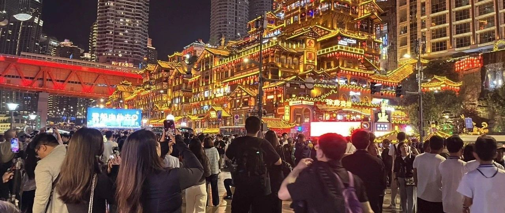
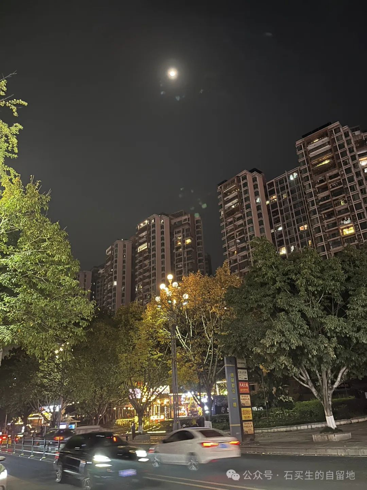
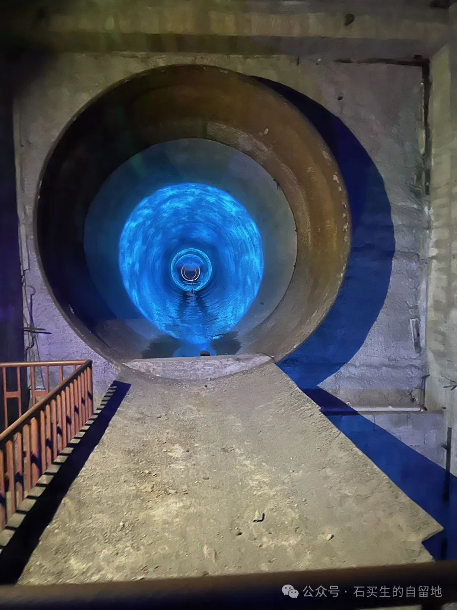
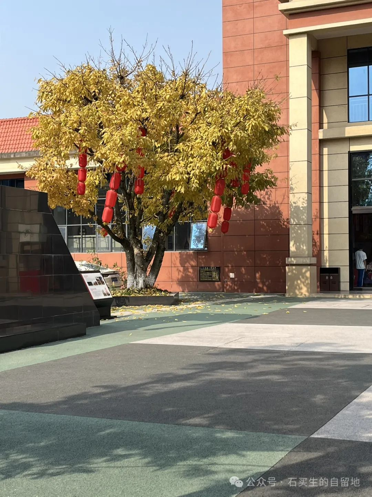
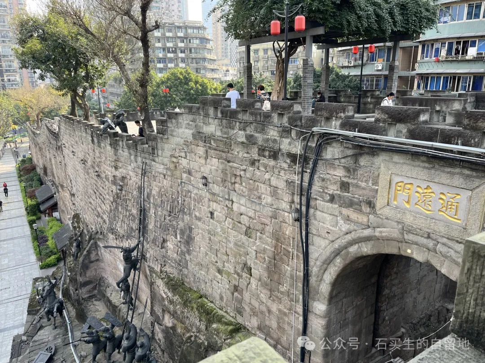
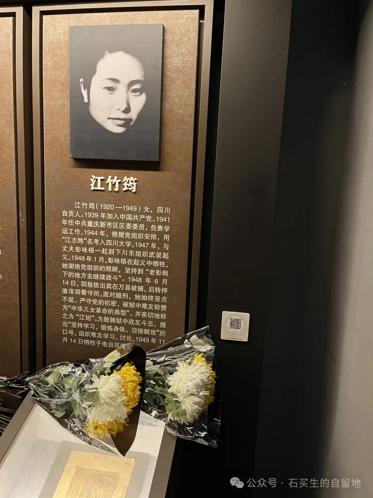
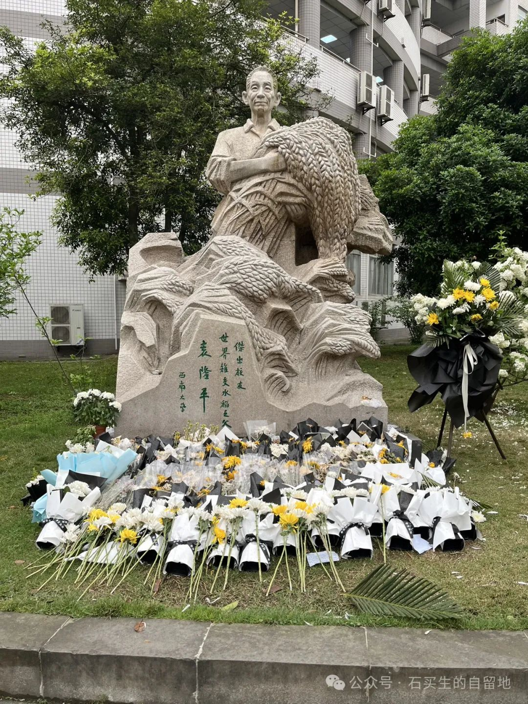

#  渝行记

原创  石买生  [ 石买生的自留地 ](javascript:void\(0\);)

__ _ _ _ _

  

渝行记

  

小智

  

4月10日早晨

在智选假日酒店一楼

我正等电梯

AI小智和我同进电梯

她对我说

我上二楼

你如果需要帮助

请联系前台

刚说完她就出去了

她的热情和谦虚

转瞬即逝

像一缕轻烟

  

自拍照片

  

重庆的月亮

  

只比楼高一点

相较江边璀璨灯火

她永远是配角

把清辉和更多的爱

留给得劲火锅

一江东去的春水

让敦厚的山城人

他们的笑

像一张张创可贴

即使你去往天涯海角

也黏在你后脑勺

  

自拍照片

  

在涪陵

  

没有吃榨菜

却在一个巨大山洞里穿梭

黄褐色洞壁曲里八拐

变幻莫测

历史的跫音在里边回荡

即使出得洞来

我仍然头晕目眩

七窍生烟

眼前恍兮忽兮

一朵蘑菇云直冲怒天

那不是想象

那是历史沉重的叹息

  

自拍照片

  

黄葛树

  

的确是渝城名片

让每一个天外来客

把春天当做秋天

落叶纷纷飘零

蛋黄中带着润泽

像一张张剪纸

贴在山城步道两旁

两只宠物狗见了

意兴冲冲

一路小跑

脖颈上锦缎条幅

充满喜感

我叫发财

我叫升官

  

自拍照片

  

通远门

  

深褐色城墙历尽沧桑

六百年

等

一个白发苍苍老者

从岭南前来

抚摸

凭吊

伤怀

  

  

重庆小面

  

有吆喝声

从霓虹灯浓稠中飘出来

一个女人的声音

看过来

走过来

重庆小面

等你来

有座位哟

声音像唱出来的

绵软磁实

勾魂摄魄

  

自拍照片

  

红色基因

  

渣滓洞牢房有两排

一排关押女囚

是一层平房

一排关押男囚

是两层平房

江竹筠

被关在女囚第一间

房子里有青花被

青花碗

马桶

一白发老太进来

见到江竹筠遗像

扑过去高喊

江姐

像见到亲人

差点老泪纵横

  

自拍照片

  

我的神

  

在西南大学

我看见袁隆平

抱一大搂稻穗站着

像一个老农

刚从田里归来

脑门沟壑纵横

眼睛看着前方

浑身是汗

  

预览时标签不可点

微信扫一扫  
关注该公众号

****

****

×  分析

__

微信扫一扫可打开此内容，  
使用完整服务

：  ，  ，  ，  ，  ，  ，  ，  ，  ，  ，  ，  ，  。  视频  小程序  赞  ，轻点两下取消赞  在看  ，轻点两下取消在看
分享  留言  收藏  听过

