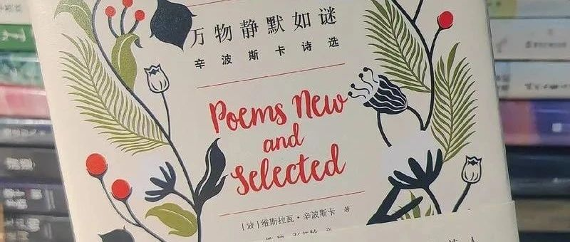
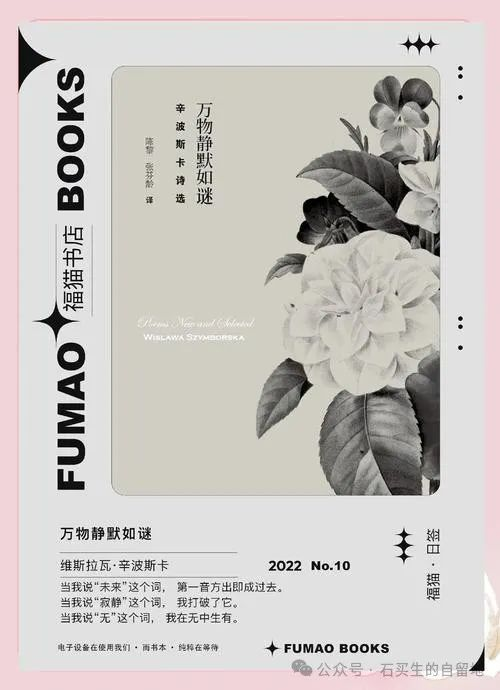

#  通灵者的密码

原创  石买生  [ 石买生的自留地 ](javascript:void\(0\);)

__ _ _ _ _

通灵者的密码

\------《万物静默如谜》导读讲稿

亲爱的同学们，上午好！

今天非常高兴跟大家分享波兰著名女诗人，1996年诺贝尔文学奖获得者辛波斯卡的诗集《万物静默如谜》的阅读心得。这本诗集的名字很有意思，表层意思是说世上万物披上了神秘面纱，隐藏很多谜团，潜台词是谜底我手中拥有密码，我将为你们一一揭开。法国天才诗人兰波，对诗人有由衷赞美，称诗人为万物的“通灵者”，说诗人通晓万物的灵性，掌管万物之谜的密码。所以我今天尝试解密辛波斯卡，我今天分享的主题叫《通灵者的密码》。

我们先一起走近诗人，认识一下诗集的作者：

维斯拉瓦·辛波斯卡（1923-2012）一九二三年生于波兰小镇布宁。她擅长以幽默、诗意的口吻描述严肃主题和日常事物，以诗歌回答生活。是波兰最受欢迎的诗人，也是公认为当代最为迷人的诗人之一，享有“诗界莫扎特”的美誉。一九九六年获得诺贝尔文学奖，是文学史上第三位获奖女诗人。其诗作被称为“具有不同寻常和坚韧不拔的纯洁性和力量”。

作者的名片告诉我们这几方面的信息：一是诗人经历了第二次世界大战，是在二战的废墟上成长起来世界级大诗人；二是她的诗歌题材关注日常生活，善于表现严肃主题；三是她的诗歌风格又幽默又优雅，非常迷人；四是她凭借诗歌中的纯洁性和坚韧不拔的力量获得了诺贝尔文学奖。

我们再看看诗人的照片:

波兰诗人辛波斯卡

  

面容清瘦，表情淡定、优雅，眼神充满睿智，甚至有一丝的嘲弄。这个样子，正是我想象中的诗人该有的样子。

接下来我们了解一下诗集《万物静默如谜》的相关信息：

  

  

诗集主要收集了辛波斯卡各个时期的代表作，题材丰富，能让常见之物换发新的诗意。获得过《洛杉矶时报》年度最佳图书，成为畅销书。她的迷人的作品有奇特的功能，能够擦亮我们的眼睛，让我们对我们熟悉的日常生活有新的认知。

接下来说说我与辛波斯卡的缘分：

有一回，我在电脑上读到辛波斯卡的一首诗《种种可能》，其中两句:我爱写诗的荒谬，胜过不写诗的荒谬。心里产生了强烈的共鸣。因为我知道，西班牙哲学家阿多诺曾说过：“奥斯维辛之后，写诗是野蛮的。”奥斯维辛集中营，二战期间，被称为“死亡工厂”，纳粹曾在此屠杀了400多万人，其中犹太人96万。奥斯维辛承载了人类苦难的记忆。所以阿多诺说经历奥斯维辛之后，写诗是野蛮的。而奥斯维辛就在辛波斯卡的祖国波兰，辛波斯卡为什么要对阿多诺作微妙的回应呢？我猜想，辛波斯卡的用意也许是，在一个荒谬的时代，对抗荒谬的最好手段，就是以荒谬对抗荒谬。还有就是，辛波斯卡或许想通过诗歌保留那段沉重的历史，以便我们的子孙能更好的面对未来。

作为一个语文老师，辛波斯卡的诗还让我产生了一个联想，我想起了前些年每年高考作文题，

其中要求之一是“文体不限”（诗歌除外），注意那个括号里诗歌除外，这等于把诗神缪斯从中学校园里放逐了。既然高考都不能写诗，那还读诗歌那玩意儿干啥呢。我的学生们，如果在最美的诗意的年龄，不喜欢诗，不读诗，那么，他们的青春多么黯淡，多么苍白！

所以每每此时，作为语文老师，我总想，在AI时代，为了防止精神的荒漠化，我们能否模仿辛波斯卡的诗句，大声呼吁：“我爱读诗的荒谬，胜过不读诗的荒谬！”

接下来我精选了辛波斯卡的四首诗，想通过跟同学们的分享，探究隐藏在诗歌文本里的诗人通灵的密码。我选的第一首诗是她的一首短诗《墓志铭》：

墓志铭

这里躺着，像逗点般，一个

旧派的人。她写过几首诗，

大地赐她长眠，虽然她生前

不曾加入任何文学派系。

她墓上除了这首小诗、牛蒡

和猫头鹰外，别无其他珍物。

路人啊，拿出你提包里的电脑，

思索一下辛波斯卡的命运。

我很喜欢这首短诗，短短八行，却高度概括了辛波丝卡的一生；同时，这首诗也透露了她的诗学密码。我们一起来细品这首诗，看看辛波斯卡是一个什么样子的人，她一生过的怎么样？这首诗里隐藏着怎样的通灵密码？

像逗点般、写过几首诗，表明她谦卑；不加入任何文学派系，表明她保持人格独立；大地赐予她长眠，表明她对土地充满感激；牛蒡、猫头鹰代表诗人钟爱自然。这样的诗读起来倍感亲切，原来诗人像我们芸芸众生一样，渺小如草芥，微弱如尘埃。所以她与万物平等，同万物声息相通，随时能唤醒万物的灵性，达到了庄子所追求的天人合一的境界。她度过了低调、充盈、无悔的一生。

她的通灵密码:谦卑，感恩，独立，热爱自然。

我给大家分享的她的第二首诗是《种种可能》：

种种可能（节选）

我偏爱电影

我偏爱猫

我偏爱华尔塔河岸的橡树

我偏爱狄更斯胜过杜斯妥耶夫斯基。

我偏爱我对人群的喜欢，胜过我对人类的爱

我偏爱在手边摆放针线，以备不时之需

我偏爱绿色

我偏爱写诗的荒谬，胜过不写诗的荒谬

我偏爱就爱情而言，可以天天庆祝的不特定纪念日

我偏爱书桌的抽屉

我偏爱许多此处未提及的事物

胜过许多我也没有说到的事物

这是一首长诗，诗人罗列了很多个人癖好。我节选了其中一节，从电影、猫、陀思妥耶夫斯基、针线、绿色、爱情的不特定纪念日、抽屉、未提及的事物等等，可以管中窥豹，可以看出诗人的口味独特、小众，既拥抱琐细的、被忽略的真实的生活，也渴望未曾体验的可能的生活。

读这样的诗，我们还可以跟汪国真的诗句做个有意思的比照。汪有两句诗“既然选择了远方，便只顾风雨兼程！”很有名，流传很广，当年很多文青读后心里边痒痒的，都有一种奔赴远方的冲动。但是远方在哪里？去远方干什么？皆茫然无所知。我想，假如你选择的远方是错误的，你也风雨兼程，那不是很愚蠢吗？那不是傻逼吗？所以有些诗是伪诗，是心灵鸡汤，有毒。我们要有鉴赏的眼光。

所以辛波斯卡的生活观和诗学观，朴素，真实，动人心弦。让每个读者读完诗后，遐思翩翩，激发我们强烈的探索欲望，让我们对可能的生活，心向往之。

这首诗隐藏的通灵密码：口味独特、小众，探究例外的、可能的、更真实的生活。

接下来我给大家推荐诗人的《博物馆》：

博物馆

这里有餐盘而无食欲。

有结婚戒指，但爱情至少已有三百年

未获回报。

这里有一把扇子——粉红的脸蛋哪里去了？

这里有几把剑——愤怒哪里去了？

黄昏时分鲁特琴的弦音不再响起。

因为永恒缺货

十万件古物在此聚合。

土里土气的守卫美梦正酣，

他的短髭撑靠在展示橱窗上。

金属，陶器，鸟的羽毛

无声地庆祝自己战胜了时间。

只有古埃及黄毛丫头的发夹嗤嗤傻笑。

王冠的寿命比头长。

手输给了手套。

右脚的鞋打败了右脚。

至于我，你瞧，还活着。

和我的衣服的竞赛正如火如荼进行着。

这家伙战斗的意志超乎想象！

它多想在我离去之后继续存活！

这首诗是诗人的代表作之一。作者用哲人的眼光在博物馆发现了一些永恒的主题：人、时间、古物。戒指沉睡三百年没有回应，粉红的脸蛋藏在扇子的背后，王冠还在，国王没了，右脚的鞋鞋打败了右脚，一万件古物聚合，古物后面的人消失了。诗的主题表现了人怎样被时间给打败了，古物又怎样吞噬了主人，同时又超越世间之上。这也是一首智性诗歌，诗人的目光犀利并且有穿透力。这首诗让读者清醒地认识到人在时间中的位置，即使转瞬即逝，也要绚烂一时。就像深夜昙花，即使盛开就凋谢，但瞬间的美，就是存在过的价值。所以好的诗歌，能启迪我们的心智，引领我们沉思生命的意义。

这首诗还让我联想到著名作家史铁生，作为一个在轮椅上度过大半生的残疾人，史铁生在他的作品里，也常常用哲人的眼光，进行形而上的思考。他曾说人活在世界上，面临三种困惑：一是孤独，即从根本上说，人与人之间难于沟通和理解；二是关于爱，对爱的渴望而不得；三是关于死亡，对死亡的恐惧，可以说贯穿人的一生。所以在史铁生看来，人是一种悲剧性动物。

由此看来，诗人和作家在对永恒主题的追问上，确实有相似之处。

这首诗隐藏的通灵密码：用哲学的眼光思索永恒的主题。

接下来给大家分享诗人的《越南》：

越南

妇人，你叫什麽名字？——我不知道。

你生于何时，来自何处？——我不知道。

你为什麽在地上挖洞？——我不知道。

你在这里多久了？——我不知道。

你为什麽咬我的手指？——我不知道。

你不知道我们不会害你吗？——我不知道。

你站在哪一方？——我不知道。

战争正在进行着，你必须有所选择。——我不知道。

你的村子还存在吗？——我不知道。

这些是你的孩子吗？——是的。

这首诗形式新颖，由两个人物的对话构成。写得异常冷静，貌似冷酷得不近人情。一个妇人正在打洞准备埋自己的孩子。表面对一切无关的提问漠不关心，实则强忍内心的悲痛，把战争给人带来的心灵的创伤表现得淋漓尽致。诗歌扣人心弦，催人泪下，有一种感人的悲剧带来的震撼。这首诗，让我们深深体味到诗人情怀的悲悯与高贵。此时的辛波斯卡，让我们看到了大诗人杜甫的影子。面对这样的诗，这样的诗人，我们应该脱帽致敬！

这首诗隐藏的诗学密码:悲悯的情怀与正确的三观。

结束语：

今天，我们欣赏了《万物静默如谜》里的几首诗，充分领略了辛波斯卡诗句的优雅、睿智和隽永。探究了她解密万物的方式和姿态。希望大家多读辛波斯卡的诗，让诗给我平淡的生活增添一点绚烂的色彩！

《纽约时报》评价：她的诗可能拯救不了世界，但世界将因她的作品而变得不再一样。我想，如果大家亲近她的诗歌，我们们的生活也许会变得不一样!

我的分享到此为止，谢谢大家！

  

  

注：图片来自网络

预览时标签不可点

微信扫一扫  
关注该公众号

****

****

×  分析

__

微信扫一扫可打开此内容，  
使用完整服务

：  ，  ，  ，  ，  ，  ，  ，  ，  ，  ，  ，  ，  。  视频  小程序  赞  ，轻点两下取消赞  在看  ，轻点两下取消在看
分享  留言  收藏  听过

