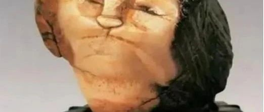
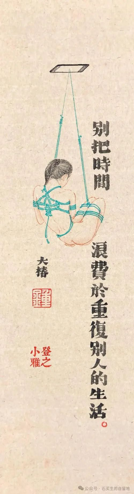
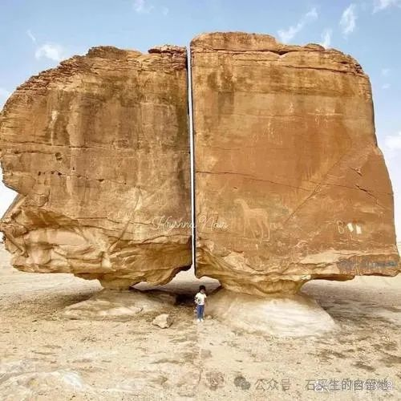
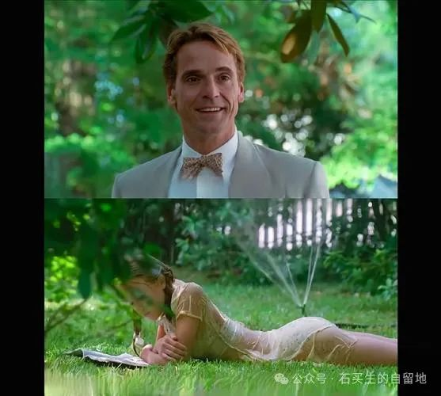

#  我是一颗什么骰子

原创  石买生  [ 石买生的自留地 ](javascript:void\(0\);)

__ _ _ _ _

图片来自网络

  

我是一颗什么骰子

  

卫平兄写了一首诗

让四位朋友和四个AI

挑选最重要的的词

结果人类和机器合谋

演了一出哑剧

A I邪魅一笑

奢侈和无用各占其二

人类只有一个微弱的点缀

从诗中成功出局

我早已踩着虚无的节拍

混迹其中

一个骰子抛出去

让世界更加不辨真假

无分东西

在空虚和无聊中

充满讽刺的气息

  

图片来自网络

  

钉子、石头与缝隙

  

我喜欢辛波斯卡

嘲讽的眼神

她好像一颗钉子

满世界寻找缝隙

一辈子追求

把快乐赐予世界

将疼痛留给自己

如果石头没有缝隙

且明确表示拒绝

她就自己变成

一块石头

让钉子变成一缕空气

曳进石头心里

  

图片来自网络

  

另一个亨伯特

  

在那个美丽的夏天

洛丽塔是一团绿色的火苗

把亨伯特的生命照亮

美利坚由此明媚

一个老男人

命运开始跌宕癫狂

另一个老男人啜饮罂粟

迷离沉醉

在第三条河岸

不能自拔

  

  

注：图片来自网络

预览时标签不可点

微信扫一扫  
关注该公众号

****

****

×  分析

__

微信扫一扫可打开此内容，  
使用完整服务

：  ，  ，  ，  ，  ，  ，  ，  ，  ，  ，  ，  ，  。  视频  小程序  赞  ，轻点两下取消赞  在看  ，轻点两下取消在看
分享  留言  收藏  听过

